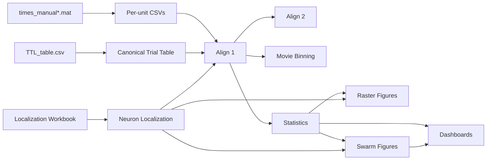

# CNL 24 Python Pipeline Project

> A modular neuroscience analysis pipeline for the UCLA Cognitive Neurophysiology Laboratory (CNL) / Fried Laboratory naturalistic movie task.

---

## Table of Contents

- [Project Overview](#project-overview)
- [Project Goals](#project-goals)
- [Scientific Background](#scientific-background)
- [Repository Architecture](#repository-architecture)
- [Current Project Status](#current-project-status)
- [End-to-End Pipeline](#end-to-end-pipeline)
- [Repository Layout](#repository-layout)
- [Major Data Products](#major-data-products)
- [Environment Setup](#environment-setup)
- [Running the Pipeline](#running-the-pipeline)
- [Understanding the Outputs](#understanding-the-outputs)
- [Testing](#testing)
- [Coding Standards](#coding-standards)
- [Roadmap](#roadmap)
- [License](#license)
- [Acknowledgements](#acknowledgements)

---

# Project Overview

## Purpose

This repository contains a complete architectural refactoring of a legacy neuroscience analysis pipeline originally developed for the **UCLA Cognitive Neurophysiology Laboratory (CNL)** and **Fried Laboratory** for the naturalistic movie memory experiment.

Rather than introducing a new scientific methodology, this project modernizes the software architecture while preserving the experimental workflow and scientific behavior of the original implementation.

The legacy pipeline consisted primarily of a single Python script responsible for nearly every stage of the analysis, including:

- loading spike trains
- reading behavioral timing files
- parsing TTL timing tables
- performing spike alignment
- computing neuron-level statistics
- generating raster plots
- producing population summaries

Although scientifically validated, the monolithic implementation became increasingly difficult to understand, maintain, extend, and test as new functionality was added.

This repository separates those responsibilities into small, well-defined packages that each perform a single stage of the analysis pipeline.

The result is software that is easier to validate, easier to document, easier to test, and substantially easier to extend without changing the underlying neuroscience.

> [!NOTE]
> The objective of this refactor is **architectural modernization**, not scientific redesign. Wherever possible, the refactored pipeline produces equivalent scientific outputs while dramatically improving readability, modularity, and long-term maintainability.

---

# Project Goals

The repository was designed around three independent objectives.

## 1. Preserve Experimental Behavior

The original experimental paradigm remains intentionally unchanged.

This includes:

- naturalistic movie viewing
- recognition memory testing
- spike alignment
- anatomical localization
- neuron-level statistical analysis
- raster generation
- population summaries

Scientific reproducibility takes priority over architectural convenience. Every major design decision favors preserving experimental behavior while improving code organization.

---

## 2. Modernize the Software Architecture

The original implementation combined preprocessing, behavioral metadata handling, spike alignment, statistics, visualization, and execution logic inside a single script.

The refactored repository separates those responsibilities into independent packages.

| Legacy Responsibility | Modern Package | Why the Separation Matters |
|----------------------|----------------|----------------------------|
| MATLAB preprocessing | `preprocessing/` | Decouples proprietary MATLAB output from downstream analysis. |
| Behavioral metadata | `data_io/` | Establishes one canonical representation of behavioral timing. |
| Localization lookup | `data_io/localization.py` | Centralizes anatomical inference for every downstream module. |
| TTL parsing | `data_io/ttl_table_parser.py` | Normalizes behavioral timing into a reproducible trial table. |
| Spike alignment | `analysis/` | Performs scientific calculations independently of I/O. |
| Plot generation | `plotting/` | Consumes analysis outputs without recomputing statistics. |
| Pipeline orchestration | `running/` | Coordinates execution while remaining independent of scientific logic. |

Each package exposes a clearly defined responsibility and communicates with the remainder of the repository through standardized outputs rather than internal implementation details.

---

## 3. Make the Pipeline Testable

One of the primary goals of the refactor is to make every stage independently verifiable.

Instead of requiring the entire pipeline to execute before inspecting results, each package produces explicit intermediate outputs that can be validated in isolation.

| Package | Primary Output |
|----------|----------------|
| `preprocessing` | One CSV per neuron |
| `data_io` | Canonical behavioral metadata |
| `analysis` | Alignment tables and statistical summaries |
| `plotting` | Publication-quality figures |
| `running` | Reproducible end-to-end execution |

This modular structure allows individual stages to be tested without rerunning the complete analysis, substantially reducing debugging time while improving confidence in scientific reproducibility.

---

# Scientific Background

## Experimental Task

Patients undergo intracranial microelectrode recordings while viewing naturalistic movie clips. Following the encoding phase, subjects complete a recognition task in which previously viewed ("seen") clips are intermixed with novel ("unseen") clips.

The primary scientific objective is to determine whether individual neurons—or neuronal populations—exhibit statistically significant changes in activity associated with successful memory encoding.

To accomplish this, the pipeline integrates three independent experimental data streams:

1. Spike timing information
2. Behavioral timing metadata
3. Anatomical localization metadata

Each data source is processed independently before being merged during spike alignment and statistical analysis.

> [!IMPORTANT]
> The three data streams are intentionally kept independent for as long as possible. This separation reduces coupling between modules, improves testability, and allows each processing stage to be validated independently.

---

## Primary Data Sources

The repository operates on three immutable experimental inputs.

| Source | Description | Produced By |
|--------|-------------|-------------|
| `times_manual*.mat` | MATLAB spike sorting output | Offline spike sorting workflow |
| `TTL_table.csv` | Behavioral timing export | Experimental acquisition software |
| `sub-*_localizations.xlsx` | Electrode localization workbook | Clinical localization workflow |

These files are treated as **read-only experimental artifacts**.

The repository never modifies the original experimental data. Instead, standardized intermediate products are created for downstream processing while preserving the integrity of the raw inputs.

---

# Repository Architecture

The repository is organized around the major stages of the neuroscience workflow rather than around individual file types.

Each package owns one stage of the analysis and communicates with downstream packages through standardized outputs.

## Package Documentation

| Package | Description |
|---------|-------------|
| [`preprocessing`](preprocessing/README.md) | Converts MATLAB spike sorting output into standardized per-neuron CSV files. |
| [`data_io`](data_io/README.md) | Standardizes behavioral timing metadata and anatomical localization information. |
| [`analysis`](analysis/README.md) | Performs spike alignment, binning, and statistical analysis. |
| [`plotting`](plotting/README.md) | Generates raster plots, swarm plots, and summary dashboards. |
| [`running`](running/README.md) | Coordinates configuration and end-to-end pipeline execution. |
| [`unit_tests`](unit_tests/README.md) | Validates individual modules and complete pipeline behavior. |

---

## Primary Entry Points

Most users only interact with two files.

| File | Purpose |
|------|---------|
| `running/setup_and_run.py` | Interactive launcher used for normal execution. |
| `running/pipeline_executor.py` | Converts user configuration into strongly typed objects and executes the pipeline. |

Supporting repository files include:

| File | Purpose |
|------|---------|
| `requirements.txt` | Python dependency list. |
| `pyproject.toml` | Project configuration and packaging metadata. |

---

# Repository Layout

```text
repository/

├── preprocessing/
│   ├── convert_matlab_to_csv.py
│   └── README.md
│
├── data_io/
│   ├── ttl_table_parser.py
│   ├── localization.py
│   └── README.md
│
├── analysis/
│   ├── session_alignment_align1.py
│   ├── trial_alignment_align2.py
│   ├── binning.py
│   ├── statistics.py
│   └── README.md
│
├── plotting/
│   ├── rasters.py
│   ├── swarm.py
│   ├── summary_figures.py
│   └── README.md
│
├── running/
│   ├── setup_and_run.py
│   ├── pipeline_executor.py
│   ├── config.py
│   ├── models.py
│   └── README.md
│
├── unit_tests/
│   ├── test_*.py
│   └── README.md
│
├── old_files/
├── requirements.txt
├── pyproject.toml
└── README.md
```

---

# Current Project Status

The repository has completed its transition from a monolithic analysis script to a fully modular Python pipeline.

Feature development has reached parity with the legacy implementation while significantly improving maintainability, documentation, and testability.

> [!NOTE]
> Within this repository, **Complete** indicates that the module has reached functional parity with the legacy pipeline. Future development is expected to focus primarily on documentation, validation using additional datasets, and scientific extensions rather than architectural redesign.

## Module Status

| Module | Primary Responsibility | Status |
|--------|-------------------------|--------|
| `preprocessing/convert_matlab_to_csv.py` | MATLAB spike conversion | ✅ Complete |
| `data_io/ttl_table_parser.py` | Behavioral metadata standardization | ✅ Complete |
| `data_io/localization.py` | Anatomical localization inference | ✅ Complete |
| `analysis/session_alignment_align1.py` | Session-level spike alignment | ✅ Complete |
| `analysis/trial_alignment_align2.py` | Trial-level spike alignment | ✅ Complete |
| `analysis/binning.py` | Fixed-width movie binning | ✅ Complete |
| `analysis/statistics.py` | Neuron-level statistical analysis | ✅ Complete |
| `plotting/rasters.py` | Raster and PSTH generation | ✅ Complete |
| `plotting/swarm.py` | Population swarm visualizations | ✅ Complete |
| `plotting/summary_figures.py` | Dashboard generation | ✅ Complete |
| `running/setup_and_run.py` | Interactive execution | ✅ Complete |
| `running/pipeline_executor.py` | Pipeline orchestration | ✅ Complete |
| `unit_tests/` | Automated validation suite | ✅ Complete |

---

# End-to-End Pipeline

The pipeline transforms three independent experimental data sources into standardized inputs for alignment, statistical analysis, and visualization.



## Reading the Pipeline

Each package contributes one clearly defined stage to the analysis.

| Stage | Responsibility |
|--------|----------------|
| `preprocessing` | Converts MATLAB spike sorting output into standardized neuron CSVs. |
| `data_io` | Produces canonical behavioral timing metadata and anatomical localization mappings. |
| `analysis` | Performs spike alignment, binning, and statistical analysis. |
| `plotting` | Generates publication-ready figures from analysis outputs. |
| `running` | Connects every stage into a reproducible execution workflow. |

A guiding principle of the repository is that **each stage consumes standardized outputs from the previous stage rather than recomputing upstream information**. This minimizes duplicated logic, simplifies testing, and improves long-term maintainability.

---

# Major Data Products

The repository intentionally produces several intermediate data products.

Rather than treating intermediate files as temporary implementation details, the pipeline exposes them as first-class outputs. This makes each stage independently testable, simplifies debugging, and allows downstream modules to consume standardized artifacts rather than recomputing upstream results.

## Raw Experimental Data

The following files are considered immutable experimental inputs.

| File | Description | Lifecycle |
|------|-------------|-----------|
| `times_manual*.mat` | MATLAB spike sorting output | Read-only |
| `TTL_table.csv` | Behavioral timing export | Read-only |
| `sub-*_localizations.xlsx` | Electrode localization workbook | Read-only |

> [!IMPORTANT]
> The pipeline never modifies raw experimental data. Every transformation produces new derived outputs while preserving the original source files.

---

## Derived Data Products

The repository produces a series of standardized outputs as the analysis progresses.

| Output | Produced By | Purpose |
|---------|-------------|---------|
| `times_manual_*_unit_#.csv` | `preprocessing/convert_matlab_to_csv.py` | One spike train per neuron |
| `trial_table.csv` | `data_io/ttl_table_parser.py` | Canonical behavioral timing table |
| `align1_*.csv` | `analysis/session_alignment_align1.py` | Session-aligned spike trains |
| `align2_*.csv` | `analysis/trial_alignment_align2.py` | Trial-aligned spike trains |
| `*_binned.csv` | `analysis/binning.py` | Fixed-width movie summaries |
| `neuron_summary.csv` | `analysis/statistics.py` | Canonical neuron statistics |
| `plots/rasters/**/*.png` | `plotting/rasters.py` | Neuron-level visualizations |
| `plots/swarm/**/*.png` | `plotting/swarm.py` | Population summaries |
| `plots/dashboards/*.png` | `plotting/summary_figures.py` | Dashboard figures |
| `pipeline_artifacts.json` | `running/pipeline_executor.py` | Machine-readable run manifest |

Each output represents the completion of a distinct processing stage and serves as the input to one or more downstream modules.

---

# Environment Setup

## Requirements

The pipeline targets **Python 3.11 or newer**.

Project dependencies are listed in `requirements.txt` and include packages required for preprocessing, behavioral metadata handling, spike alignment, statistical analysis, visualization, and automated testing.

---

## Creating a Virtual Environment

### Windows

```bash
python -m venv .venv
.venv\Scripts\activate
```

### macOS / Linux

```bash
python3 -m venv .venv
source .venv/bin/activate
```

---

## Installing Dependencies

```bash
pip install -r requirements.txt
```

---

## Verifying the Installation

Execute the complete automated test suite.

```bash
pytest
```

A successful test run verifies that the repository is correctly installed and that all major pipeline components are functioning as expected.

---

# Running the Pipeline

## Interactive Execution

The primary entry point for the repository is

```text
running/setup_and_run.py
```

This launcher replaces the hard-coded configuration values present in the legacy implementation with an interactive configuration workflow.

Users are prompted for patient-specific information before the pipeline constructs the configuration objects required for execution.

---

## Dry Run

The repository can also preview the filesystem layout without executing the scientific analysis.

```bash
python running/setup_and_run.py --dry-run
```

Dry-run mode performs configuration validation and output planning before terminating.

This is useful when verifying directory layouts or confirming output locations prior to processing large datasets.

---

## Typical Output Structure

A successful run produces an output directory similar to

```text
P570/

├── data/
│   └── trial_table.csv
│
├── align1/
├── align2/
├── binning/
│
├── statistics/
│   └── neuron_summary.csv
│
├── plots/
│   ├── rasters/
│   │   ├── all/
│   │   ├── sig/
│   │   ├── nonsig/
│   │   └── by_region/
│   │
│   ├── swarm/
│   │   ├── global/
│   │   ├── HPC/
│   │   ├── ERC/
│   │   ├── FC/
│   │   ├── LTC/
│   │   └── MTL/
│   │
│   └── dashboards/
│
├── localization_trace.csv
└── pipeline_artifacts.json
```

Each directory corresponds to one logical stage of the analysis pipeline, allowing intermediate results to be inspected independently.

---

# Understanding the Outputs

The pipeline intentionally preserves intermediate products so that every stage can be validated independently.

Rather than hiding intermediate computations, the repository exposes them as stable outputs that serve as interfaces between packages.

---

## `data/trial_table.csv`

The canonical behavioral timing table.

This file defines the behavioral timeline used throughout the remainder of the repository.

Typical uses include:

- determining clip start and end times
- reconstructing clip order
- identifying behavioral outcomes
- driving Align 2
- serving as the canonical timing reference for downstream analysis

Because every downstream module consumes this table, behavioral timing is computed exactly once and reused consistently throughout the pipeline.

---

## `align1/align1_*.csv`

Continuous session-aligned spike trains.

Each file represents one neuron after spike timestamps have been transformed into the movie-session reference frame.

This is the first stage where electrophysiology and behavioral metadata become integrated.

Typical downstream consumers include

- movie binning
- statistical analysis
- raster generation
- debugging alignment behavior

---

## `align2/align2_*.csv`

Trial-aligned spike trains.

Align 2 reorganizes continuous session data into individual behavioral trials.

This representation simplifies neuron-by-neuron inspection and supports trial-specific visualization and statistical analysis.

Unlike Align 1, which preserves continuous experimental time, Align 2 organizes spikes relative to behavioral events.

---

## `binning/*_binned.csv`

Fixed-width summaries of the Align 1 spike trains.

Each row represents one movie-time bin.

These outputs provide a lower temporal resolution suitable for population summaries and exploratory visualization.

Unless otherwise configured, the default bin width is **10 seconds**.

---

## `statistics/neuron_summary.csv`

The canonical statistical summary produced by the repository.

This table acts as the primary interface between the scientific analysis stage and the plotting stage.

Rather than recalculating statistical significance during visualization, every plotting module consumes this file directly.

Important fields include

| Column | Purpose |
|---------|----------|
| `Post-Stim Mean Rate (Hz)` | Raster eligibility threshold |
| `Pre-Stim Significant` | Pre-stimulus statistical significance |
| `Post-Stim Significant` | Post-stimulus statistical significance |
| `T-Score Diff (Pre - Post)` | Population comparison metric |

> [!NOTE]
> Maintaining a single statistical source of truth eliminates duplicated logic throughout the plotting package and ensures every visualization is derived from identical significance calculations.

---

## `plots/rasters/`

The raster plotting stage produces neuron-level visualizations suitable for both quality control and scientific interpretation.

Rather than generating a single figure per run, the repository organizes raster plots into multiple directories based on statistical significance and anatomical location.

### Directory Structure

| Directory | Purpose |
|-----------|---------|
| `all/` | Every neuron selected for visualization |
| `sig/` | Statistically significant neurons |
| `nonsig/` | Neurons that do not satisfy the significance criterion |
| `by_region/` | Region-specific raster collections |

The regional directories additionally contain a companion `T_score_sheet.csv`, allowing the numerical statistics and corresponding figures to remain together.

### Interpreting Raster Figures

Each raster summarizes the activity of a single neuron relative to behavioral events.

Typical figure components include:

- spike raster
- peri-stimulus time histogram (PSTH)
- optional trial splitting by behavioral outcome
- clip-end indicators
- anatomical localization
- statistical summary values
- firing-rate information

These figures are primarily intended to answer questions such as:

- Does the neuron respond near clip onset?
- Does activity differ between remembered and forgotten clips?
- Does the visualization support the statistical conclusions?
- Are there obvious alignment artifacts?

Because every raster is generated from `neuron_summary.csv`, the plotting stage never recomputes statistical significance.

---

## `plots/swarm/`

Swarm plots summarize neuronal activity across populations rather than individual neurons.

Unlike raster figures—which emphasize single-unit behavior—swarm plots provide a cohort-level view of the statistical results.

Each anatomical region receives an independent collection of summary figures.

Typical contents include

| Figure | Description |
|--------|-------------|
| `P1_Post-Stim_T-Scores.png` | Distribution of post-stimulus T-scores |
| `P2_Pre-Stim_T-Scores.png` | Distribution of pre-stimulus T-scores |
| `P3_Diff_SigOnly.png` | Difference scores for statistically significant neurons |
| `P4_Diff_All.png` | Difference scores for every analyzed neuron |
| `P5_Diff_Post_GTE_1.png` | Difference scores after post-stimulus filtering |

Each regional directory also contains

- `Swarm_Statistics_<region>.csv`
- `Summary_Overview_<region>.csv`

The repository additionally generates global summaries including

- `Summary_Global_and_Regional.csv`
- `Summary_Patient_Bipolar_Breakdown.csv`

### Interpreting Swarm Figures

Swarm plots emphasize population-level trends rather than individual neurons.

Generally,

- **P1** summarizes post-stimulus activity.
- **P2** summarizes pre-stimulus activity.
- **P3** compares statistically significant neurons.
- **P4** compares the complete analyzed population.
- **P5** focuses on neurons satisfying the post-stimulus response criterion.

Together these figures provide an overview of how neuronal populations behave across anatomical regions.

---

## `plots/dashboards/`

Dashboard figures combine multiple swarm plots into higher-level summaries intended for rapid review.

These composite figures are useful when evaluating complete pipeline runs or comparing anatomical regions without opening numerous individual figures.

The directory also contains

- `Run_Summary.csv`

which records run-level summary statistics and metadata.

---

## `localization_trace.csv`

The localization trace provides complete traceability between analyzed neurons and their inferred anatomical locations.

This file exists primarily as a validation artifact.

It allows investigators to verify that

- localization workbooks were interpreted correctly
- anatomical abbreviations were normalized as expected
- neurons were routed to the appropriate regional analyses

Because localization influences downstream plotting and population summaries, this file provides an important quality-control checkpoint.

---

## `pipeline_artifacts.json`

The pipeline artifact manifest records every major file generated during execution.

Unlike the scientific outputs, this file exists primarily for automation.

Typical downstream uses include

- validating pipeline completeness
- integration testing
- automated workflows
- reproducibility tracking
- downstream scripting

Because every generated artifact is recorded in one machine-readable manifest, external tooling does not need to reconstruct output locations by traversing the filesystem.

---

# Recommended Review Order

When examining a completed analysis for the first time, the following order generally provides the most efficient overview.

| Step | Why Start Here |
|------|----------------|
| `statistics/neuron_summary.csv` | Canonical statistical results |
| `plots/swarm/global/` | Population-level summary |
| `plots/rasters/sig/` | Inspect significant neurons |
| `plots/rasters/by_region/` | Compare anatomical regions |
| `align1/` and `align2/` | Debug alignment when necessary |

Following this progression moves naturally from statistical summaries toward increasingly detailed representations of the underlying data.

---

# Testing

The repository includes a comprehensive automated test suite.

Execute all tests using

```bash
pytest
```

The test suite validates each major architectural layer independently.

| Test Area | Purpose |
|-----------|---------|
| TTL parsing | Behavioral metadata standardization |
| Localization | Anatomical lookup and normalization |
| Align 1 | Session-level spike alignment |
| Align 2 | Trial-level spike alignment |
| Binning | Fixed-width temporal summaries |
| Statistics | Neuron-level statistical analysis |
| Plotting | Figure generation |
| Pipeline planning | Filesystem planning and execution |

One of the principal architectural goals of the repository is that every stage can be tested independently without requiring the entire pipeline to execute.

---

# Coding Standards

The repository follows a strict single-responsibility architecture.

Each package owns one stage of the scientific workflow and communicates with downstream packages through standardized outputs.

## Package Responsibilities

| Package | Responsibility |
|---------|----------------|
| `preprocessing` | Convert MATLAB spike sorting output into standardized neuron CSVs |
| `data_io` | Standardize behavioral timing and anatomical metadata |
| `analysis` | Perform spike alignment, temporal binning, and statistical analysis |
| `plotting` | Produce publication-quality figures |
| `running` | Coordinate end-to-end execution |

---

## Documentation Philosophy

Documentation throughout the repository emphasizes **why** code exists in addition to **what** it does.

Public modules should document

- scientific purpose
- architectural role
- inputs
- outputs
- implementation strategy
- important design decisions
- testing expectations

Whenever practical, package documentation explains the algorithms and processing stages used internally rather than only presenting function signatures.

---

## Implementation Philosophy

Downstream stages should consume standardized outputs instead of reinterpreting upstream data.

Examples include

- plotting consumes `neuron_summary.csv`
- Align 2 consumes Align 1 outputs together with `trial_table.csv`
- visualization modules never recompute statistical significance
- behavioral timing is standardized exactly once inside `data_io`

This separation minimizes duplicated logic while improving reproducibility and maintainability.

---

# Roadmap

The repository has reached functional parity with the original neuroscience pipeline.

Future development is expected to focus on

- documentation improvements
- validation using additional datasets
- scientific feature extensions
- automated quality assurance
- long-term maintainability

rather than major architectural redesign.

---

# License

License information will be added in a future revision.

---

# Acknowledgements

This repository refactors and documents a neuroscience analysis pipeline originally developed for the **UCLA Cognitive Neurophysiology Laboratory (CNL)** and **Fried Laboratory**.

The scientific methodology originates from the original experimental workflow.

This project focuses on improving the software architecture, modularity, documentation, testing, and long-term maintainability while preserving the underlying scientific analysis.