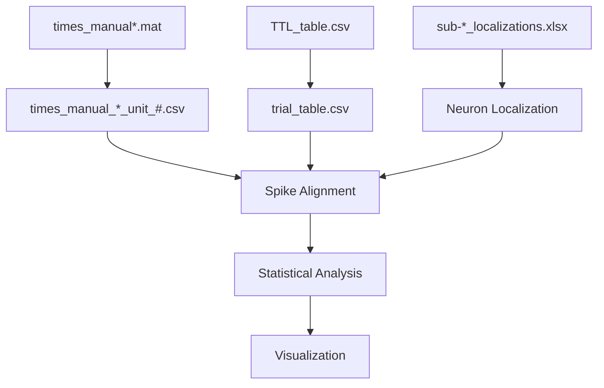

# CNL AATMI Project

> Refactored neuroscience analysis pipeline for the UCLA Cognitive Neurophysiology Laboratory (CNL) / Fried Laboratory naturalistic movie task.

---

# Table of Contents

- [Project Overview](#project-overview)
- [Project Goals](#project-goals)
- [Scientific Background](#scientific-background)
- [Repository Architecture](#repository-architecture)
- [Current Project Status](#current-project-status)
- [End-to-End Pipeline](#end-to-end-pipeline)
- [Repository Layout](#repository-layout)
- [Major Data Products](#major-data-products)
- [Current Modules](#current-modules)
- [Design Philosophy](#design-philosophy)
- [Installation](#installation)
- [Running the Pipeline](#running-the-pipeline)
- [Testing](#testing)
- [Roadmap](#roadmap)
- [Contributing](#contributing)

---

# Project Overview

## Purpose

This repository contains a complete refactoring of a legacy neuroscience
analysis pipeline originally developed for the UCLA Cognitive Neurophysiology Laboratory (CNL) / Fried Laboratory.

The original codebase consisted primarily of a single monolithic Python
script responsible for:

- loading spike trains
- reading behavioral timing files
- converting stimulus timing into analysis windows
- aligning spikes to behavioral events
- computing neuron-level statistics
- generating raster plots
- producing summary figures

While scientifically correct, the monolithic implementation became
difficult to understand, modify, test, and extend.

The goal of this repository is **not** to change the scientific analysis.

Instead, it restructures the original implementation into a collection of
small, independently testable modules while preserving the original
experimental workflow.

---

## Refactoring Goals

The guiding principles of this refactor are:

- Preserve the scientific behavior of the original pipeline.
- Improve readability.
- Separate unrelated responsibilities into independent modules.
- Remove hidden assumptions and hardcoded values whenever possible.
- Make every processing stage independently executable.
- Allow every module to be unit tested.
- Produce documentation that serves as the project specification.

The repository should ultimately be understandable without needing to read
the original monolithic script.

---

# Project Goals

This repository is intended to accomplish three independent goals.

## 1. Preserve Experimental Behavior

The original experimental paradigm is intentionally preserved.

This includes:

- naturalistic movie viewing
- recognition task
- spike alignment
- localization lookup
- neuron-by-neuron analyses

The refactor should produce equivalent scientific results whenever
possible.

---

## 2. Modernize the Software Architecture

The original codebase contained many unrelated operations inside a single
script.

These responsibilities have been separated into independent packages.

Examples include:

| Original Responsibility | Refactored Module |
| --- | --- |
| MATLAB preprocessing | `preprocessing/` |
| Behavioral metadata | `data_io/` |
| Localization lookup | `data_io/localization.py` |
| TTL parsing | `data_io/ttl_table_parser.py` |
| Statistical analyses | `analysis/` *(planned)* |
| Plot generation | `plotting/` *(planned)* |

Each module is responsible for a single stage of the pipeline.

---

## 3. Produce Maintainable Research Software

This repository is intended to become a long-term research codebase rather
than a one-off analysis script.

Consequently:

- every public function is documented
- every major module has its own README
- every processing stage can be tested independently
- every derived data product is documented

---

# Scientific Background

## Experimental Task

Patients view naturalistic movie clips while intracranial microelectrode
recordings are collected.

Following movie presentation, subjects complete a recognition task in which
previously viewed clips ("seen") are intermixed with novel clips ("unseen").

The primary scientific objective is to determine whether individual neurons
or neuronal populations exhibit differential activity related to successful
memory encoding.

The analysis pipeline therefore combines three independent sources of data:

1. Spike timing information
2. Behavioral timing information
3. Anatomical localization information

These three data streams are processed independently before being combined
during spike alignment and statistical analysis.

---

## Primary Data Sources

| Source | Description | Produced By |
| --- | --- | --- |
| `times_manual*.mat` | MATLAB spike sorting output | Offline spike sorting |
| `TTL_table.csv` | Behavioral timing table | Experimental acquisition software |
| `sub-*_localizations.xlsx` | Electrode localization workbook | Clinical localization pipeline |

These files are treated as immutable raw experimental data.

The refactored pipeline never modifies them.

Instead, standardized intermediate files are produced for downstream
analysis.

---

# Repository Architecture

The repository is organized according to processing responsibility rather
than execution order.

| Directory | Responsibility | Status |
| --- | --- | --- |
| `preprocessing/` | Convert MATLAB spike sorting output into per-unit CSV files | Complete |
| `data_io/` | Read and standardize experimental metadata | Complete |
| `analysis/` | Statistical analyses | Not implemented |
| `plotting/` | Figure generation | Not implemented |
| `tests/` | Automated pytest unit tests | In progress |
| `docs/` | Detailed project documentation | Planned |

No directory should perform responsibilities belonging to another package.

For example:

- `data_io` never performs plotting.
- `plotting` never parses raw experimental files.
- `analysis` never modifies experimental metadata.

This separation of concerns is one of the primary goals of the refactor.

---

# Current Project Status

The repository is currently under active refactoring.

Only modules that have been fully implemented and documented should be
considered stable. Placeholder directories exist for future work but should
not yet be considered part of the production pipeline.

## Module Status

| Module | Purpose | Status |
| --- | --- | --- |
| `preprocessing/convert_matlab_to_csv.py` | Convert MATLAB spike sorting output into per-unit CSV files | Complete |
| `data_io/ttl_table_parser.py` | Parse behavioral TTL tables into standardized trial tables | Complete |
| `data_io/localization.py` | Load localization workbooks and infer neuron anatomy | Complete |
| `tests/test_ttl_table_parser.py` | Automated TTL parser unit tests | Complete |
| `tests/test_localization.py` | Automated localization unit tests | Complete |
| `analysis/` | Statistical analyses | Not implemented |
| `plotting/` | Raster plots, PSTHs, and summary figures | Not implemented |

Future modules will follow the same design principles and documentation
style established by the existing code.

---

# End-to-End Pipeline

The analysis pipeline transforms three independent experimental data
sources into a standardized set of inputs suitable for spike alignment,
statistical analysis, and visualization.

The three raw experimental inputs are:

- MATLAB spike sorting output
- Behavioral timing information
- Electrode localization information

These are processed independently before being merged later in the analysis
pipeline.



Each stage is intentionally isolated.

This allows preprocessing, behavioral metadata, and localization metadata
to be independently tested and validated before they are merged during
later analyses.

---

# Repository Layout

```
repository/

├── preprocessing/
│
│   convert_matlab_to_csv.py
│   README.md
│
├── data_io/
│
│   ttl_table_parser.py
│   localization.py
│   README.md
│
├── analysis/
│
│   README.md
│
├── plotting/
│
│   README.md
│
├── tests/
│
│   test_ttl_table_parser.py
│   test_localization.py
│
├── test_scripts/
│
│   README.md
│
├── docs/
│
│   (planned)
│
├── config.py
├── models.py
├── requirements.txt
└── README.md
```

Each package has a single primary responsibility.

Modules should not perform work belonging to another package.

---

# Repository Responsibilities

## preprocessing/

Responsible for converting raw MATLAB spike sorting output into
standardized CSV files.

### Inputs

- MATLAB v7.3 files
- `cluster_class`

### Outputs

- One CSV per neuron

### Does

- Reads MATLAB files
- Extracts spike times
- Writes per-unit CSVs

### Does Not

- Read behavioral metadata
- Read localization data
- Perform statistics
- Generate plots

---

## data_io/

Responsible for loading and standardizing experimental metadata.

### Inputs

- TTL tables
- Localization workbooks

### Outputs

- Standardized trial tables
- Standardized localization information

### Does

- Parse behavioral metadata
- Standardize timing variables
- Match neuron filenames to localization tables

### Does Not

- Perform spike alignment
- Compute statistics
- Generate figures

---

## analysis/

Responsible for all statistical analyses.

Status:

> Not implemented.

Planned responsibilities include:

- Spike alignment
- Baseline calculations
- Window statistics
- Population statistics
- Recognition analyses

---

## plotting/

Responsible for all visualization.

Status:

> Not implemented.

Planned responsibilities include:

- Raster plots
- PSTHs
- Swarm plots
- Summary figures

---

# Major Data Products

The repository intentionally produces several intermediate data products.

Each one exists to isolate a stage of the analysis pipeline and simplify
testing and debugging.

## Raw Experimental Files

These files are never modified.

| File | Description |
| --- | --- |
| `times_manual*.mat` | MATLAB spike sorting output |
| `TTL_table.csv` | Behavioral timing table |
| `sub-*_localizations.xlsx` | Electrode localization workbook |

---

## Derived Files

These files are produced by the repository.

| File | Produced By | Purpose |
| --- | --- | --- |
| `times_manual_*_unit_#.csv` | `convert_matlab_to_csv.py` | One spike train per neuron |
| `trial_table.csv` | `ttl_table_parser.py` | Canonical behavioral trial table |

Future derived files will be documented here as they are implemented.

---

# Data Flow Philosophy

One of the primary design goals of this repository is that every
transformation is explicit.

Raw experimental data should never be modified.

Instead, each processing stage creates a new standardized representation
that becomes the input to the next stage.

For example:

```
Raw TTL_table.csv

↓

trial_table.csv

↓

Spike Alignment

↓

Statistics

↓

Plots
```

Likewise,

```
Raw MATLAB

↓

Per-neuron CSVs

↓

Spike Alignment
```

and

```
Localization Workbook

↓

Standardized Localization Metadata

↓

Spike Alignment
```

This approach provides several advantages:

- Raw data remain immutable.
- Intermediate files can be inspected independently.
- Individual stages can be unit tested.
- Bugs are easier to isolate.
- New processing stages can be inserted without modifying earlier stages.


---

# Canonical Data Products

The repository intentionally creates standardized intermediate files.

Rather than passing raw experimental files directly into downstream
analysis, each stage produces a well-defined artifact with a documented
schema.

These intermediate files serve several purposes:

- simplify debugging
- provide stable interfaces between modules
- preserve raw experimental data
- make unit testing possible
- make each processing stage independently executable

---

## MATLAB Spike Files

### Input

```
times_manual*.mat
```

Produced by:

- Offline spike sorting software

Format:

- MATLAB v7.3 (HDF5)

Purpose:

- Stores clustered spike times for every detected neuron.

Consumed by:

- `preprocessing/convert_matlab_to_csv.py`

---

### Output

```
times_manual_*_unit_#.csv
```

One CSV is produced for every detected neuron.

Columns

| Column | Units | Description |
| --- | --- | --- |
| `units` | integer | Unit identifier |
| `s` | seconds | Spike time |

Produced by

```
preprocessing/convert_matlab_to_csv.py
```

Consumed by

Future spike alignment modules.

---

## Behavioral Metadata

### Input

```
TTL_table.csv
```

Produced by

Behavioral acquisition software.

Purpose

Stores the behavioral timeline of the experiment, including:

- experiment phases
- movie identifiers
- clip identifiers
- behavioral responses
- timing information
- event tags

This file is considered immutable.

It is never modified by the repository.

---

### Output

```
trial_table.csv
```

Produced by

```
data_io/ttl_table_parser.py
```

Purpose

Provides a standardized behavioral table for every downstream analysis.

The parser preserves raw behavioral variables while appending
analysis-specific columns.

Future statistical modules should consume `trial_table.csv` rather than
the raw TTL table.

---

## Localization Metadata

### Input

```
sub-*_localizations.xlsx
```

Purpose

Stores the anatomical localization associated with every implanted
electrode.

This workbook is interpreted by

```
data_io/localization.py
```

The workbook itself is never modified.

---

### Output

Standardized localization metadata.

Currently returned as Python objects.

Future versions may optionally export a standardized localization table.

---

# Installation

## Requirements

Python 3.11 or newer is recommended.

Required packages currently include:

- numpy
- pandas
- scipy
- matplotlib
- seaborn
- h5py

Additional dependencies may be introduced as future modules are
implemented.

---

## Creating a Virtual Environment

Windows

```
python -m venv .venv

.venv\Scripts\activate
```

macOS / Linux

```
python3 -m venv .venv

source .venv/bin/activate
```

---

## Installing Dependencies

```
pip install -r requirements.txt
```

---

# Running the Repository

Each implemented module is designed to be executable independently.

Current executable modules include:

| Module | Purpose |
| --- | --- |
| `convert_matlab_to_csv.py` | Convert MATLAB spike files into per-unit CSV files |
| `ttl_table_parser.py` | Convert raw TTL tables into standardized trial tables |

Future executable modules will be added here.

---

# Testing

The repository uses unit tests.

---

## Automated Tests

Located in

```
tests/
```

Purpose

Regression testing.

Every implemented module should eventually have an accompanying pytest
suite.

Current automated tests include:

| Test | Purpose |
| --- | --- |
| `test_ttl_table_parser.py` | Validate TTL parsing and derived trial tables |
| `test_localization.py` | Validate localization lookup |

Future modules should include corresponding automated tests.

---

# Coding Standards

The repository follows several architectural principles.

## Single Responsibility

Every module should perform one clearly defined task.

Examples

- preprocessing converts MATLAB files.
- data_io loads metadata.
- analysis performs statistics.
- plotting generates figures.

---

## Preserve Raw Data

Raw experimental files are never modified.

Instead,

```
raw file

↓

standardized file

↓

analysis
```

This preserves provenance and greatly simplifies debugging.

---

## Prefer Explicit Data Flow

Intermediate data products should be written to disk whenever doing so
improves reproducibility or debugging.

Hidden transformations should be avoided.

---

## Descriptive Names

Columns created by the repository should clearly communicate their
purpose.

For example

| Legacy | Current |
| --- | --- |
| `ms start` | `clipStartTimeMs` |
| `ms end` | `clipEndTimeMs` |
| `Plot Toggle` | `includeInPlots` |
| `Accurate` | `isAccurate` |

Raw experimental column names should remain unchanged whenever possible.

---

## Documentation First

Every public module should contain:

- module documentation
- public function documentation
- testing documentation
- example usage
- README

The documentation should describe the intended behavior of the software,
not merely its current implementation.

---

# Roadmap

The following components are planned but have not yet been implemented.

## Analysis

Status

**Not implemented.**

Planned functionality

- spike alignment
- baseline subtraction
- window statistics
- neuron-level analyses
- population analyses

---

## Plotting

Status

**Not implemented.**

Planned functionality

- raster plots
- PSTHs
- swarm plots
- summary figures

---

## Documentation

Status

In progress.

Planned documentation includes

- `docs/ARCHITECTURE.md`
- `docs/PIPELINE.md`
- `docs/DATA_MODEL.md`
- `docs/TTL_TABLE.md`
- `docs/LOCALIZATION.md`
- `docs/TESTING.md`

---

# Contributing

When adding new functionality to the repository:

1. Create a dedicated module.
2. Keep responsibilities focused.
3. Document all public functions.
4. Add or update unit tests.
5. Update the relevant README.
6. Preserve raw experimental data.
7. Prefer descriptive names for newly derived variables.

---

# License

Not yet specified.

---

# Acknowledgements

This repository refactors and documents a neuroscience analysis pipeline
developed for the UCLA Cognitive Neurophysiology Laboratory
(CNL) / Fried Laboratory.

The scientific methodology originates from the original experimental
pipeline. This repository focuses on improving the software architecture,
documentation, testing, and long-term maintainability while preserving the
underlying scientific workflow.