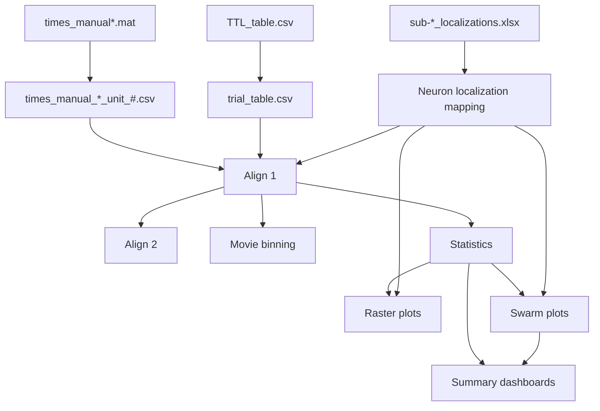

# CNL 24 Python Pipeline Project

> Refactored neuroscience analysis pipeline for the UCLA Cognitive
> Neurophysiology Laboratory (CNL) / Fried Laboratory naturalistic movie
> task.

------------------------------------------------------------------------

# Table of Contents

- [Project Overview](#project-overview)
- [Project Goals](#project-goals)
- [Scientific Background](#scientific-background)
- [Repository Structure](#repository-structure)
- [Current Project Status](#current-project-status)
- [End-to-End Pipeline](#end-to-end-pipeline)
- [Repository Layout](#repository-layout)
- [Major Data Products](#major-data-products)
- [Environment Setup](#environment-setup)
- [Running the Pipeline](#running-the-pipeline)
- [Understanding the Outputs](#understanding-the-outputs)
- [Testing](#testing)
- [Coding Standards](#coding-standards)
- [Roadmap](#roadmap)
- [License](#license)
- [Acknowledgements](#acknowledgements)

------------------------------------------------------------------------

# Project Overview

## Purpose

This repository contains a complete refactoring of a legacy neuroscience
analysis pipeline originally developed for the UCLA Cognitive
Neurophysiology Laboratory (CNL) / Fried Laboratory.

The original codebase consisted primarily of a single monolithic Python
script responsible for:

- loading spike trains
- reading behavioral timing files
- converting stimulus timing into analysis windows
- aligning spikes to behavioral events
- computing neuron-level statistics
- generating raster plots
- producing summary figures

While scientifically correct, the monolithic implementation became
difficult to understand, modify, test, and extend.

The goal of this repository is **not** to change the scientific
analysis.

Instead, it restructures the original implementation into a collection
of small, independently testable modules while preserving the original
experimental workflow.

------------------------------------------------------------------------

# Project Goals

This repository is intended to accomplish three independent goals.

## 1. Preserve Experimental Behavior

The original experimental paradigm is intentionally preserved.

This includes:

- naturalistic movie viewing
- recognition task
- spike alignment
- localization lookup
- neuron-by-neuron analyses

The refactor should produce equivalent scientific results whenever
possible.

------------------------------------------------------------------------

## 2. Modernize the Software Architecture

The original codebase contained many unrelated operations inside a
single script.

These responsibilities have been separated into independent packages.

| Original Responsibility        | Refactored Module             |
|:-------------------------------|:------------------------------|
| MATLAB preprocessing           | `preprocessing/`              |
| Behavioral metadata            | `data_io/`                    |
| Localization lookup            | `data_io/localization.py`     |
| TTL parsing                    | `data_io/ttl_table_parser.py` |
| Align 1 / Align 2 / statistics | `analysis/`                   |
| Plot generation                | `plotting/`                   |
| Pipeline orchestration         | `running/`                    |

Each module is responsible for a single stage of the pipeline.

------------------------------------------------------------------------

## 3. Make the Pipeline Testable

The refactor introduces explicit intermediate outputs so each stage can
be checked independently:

- preprocessing writes one CSV per neuron
- `data_io` standardizes timing metadata
- `analysis` creates alignment outputs and summary statistics
- `plotting` consumes analysis outputs to generate figures
- `running` provides a reproducible end-to-end entry point

That separation makes it possible to validate each stage without
rerunning the entire pipeline.

------------------------------------------------------------------------

# Scientific Background

## Experimental Task

Patients view naturalistic movie clips while intracranial microelectrode
recordings are collected.

Following movie presentation, subjects complete a recognition task in
which previously viewed clips (“seen”) are intermixed with novel clips
(“unseen”).

The primary scientific objective is to determine whether individual
neurons or neuronal populations exhibit differential activity related to
successful memory encoding.

The analysis pipeline therefore combines three independent sources of
data:

1.  Spike timing information
2.  Behavioral timing information
3.  Anatomical localization information

These three data streams are processed independently before being
combined during spike alignment and statistical analysis.

------------------------------------------------------------------------

## Primary Data Sources

| Source                     | Description                     | Produced By                       |
|:---------------------------|:--------------------------------|:----------------------------------|
| `times_manual*.mat`        | MATLAB spike sorting output     | Offline spike sorting             |
| `TTL_table.csv`            | Behavioral timing table         | Experimental acquisition software |
| `sub-*_localizations.xlsx` | Electrode localization workbook | Clinical localization pipeline    |

These files are treated as immutable raw experimental data.

The refactored pipeline never modifies them.

Instead, standardized intermediate files are produced for downstream
analysis.

------------------------------------------------------------------------

# Repository Structure

## Package Documentation

| Package         | Documentation                                      |
|:----------------|:---------------------------------------------------|
| `preprocessing` | [preprocessing/README.md](preprocessing/README.md) |
| `data_io`       | [data_io/README.md](data_io/README.md)             |
| `analysis`      | [analysis/README.md](analysis/README.md)           |
| `plotting`      | [plotting/README.md](plotting/README.md)           |
| `running`       | [running/README.md](running/README.md)             |
| `unit_tests`    | [unit_tests/README.md](unit_tests/README.md)       |

## Entry Points

| File                           | Purpose                                                     |
|:-------------------------------|:------------------------------------------------------------|
| `running/setup_and_run.py`     | Interactive pipeline launcher and dry-run planner           |
| `running/pipeline_executor.py` | Converts prompted values into objects and runs the pipeline |
| `requirements.txt`             | Python dependencies                                         |
| `pyproject.toml`               | Package configuration                                       |

## Repository Layout

``` text
repository/

├── preprocessing/
│   ├── convert_matlab_to_csv.py
│   └── README.md
│
├── data_io/
│   ├── ttl_table_parser.py
│   ├── localization.py
│   └── README.md
│
├── analysis/
│   ├── session_alignment_align1.py
│   ├── trial_alignment_align2.py
│   ├── binning.py
│   ├── statistics.py
│   └── README.md
│
├── plotting/
│   ├── rasters.py
│   ├── swarm.py
│   ├── summary_figures.py
│   └── README.md
│
├── running/
│   ├── setup_and_run.py
│   ├── pipeline_executor.py
│   ├── config.py
│   ├── models.py
│   └── README.md
│
├── unit_tests/
│   ├── test_*.py
│   └── README.md
│
├── old_files/
├── requirements.txt
├── pyproject.toml
└── README.md
```

------------------------------------------------------------------------

# Current Project Status

The repository has completed its transition from the legacy monolithic
implementation to a modular analysis pipeline.

## Module Status

| Module                                   | Purpose                                                           | Status   |
|:-----------------------------------------|:------------------------------------------------------------------|:---------|
| `preprocessing/convert_matlab_to_csv.py` | Convert MATLAB spike sorting output into per-unit CSV files       | Complete |
| `data_io/ttl_table_parser.py`            | Parse behavioral TTL tables into standardized trial tables        | Complete |
| `data_io/localization.py`                | Load localization workbooks and infer neuron anatomy              | Complete |
| `analysis/session_alignment_align1.py`   | Align per-unit spike CSVs to the movie/session timeline (Align 1) | Complete |
| `analysis/trial_alignment_align2.py`     | Assign movie-aligned spikes to behavioral trial windows (Align 2) | Complete |
| `analysis/binning.py`                    | Bin movie-aligned spikes at fixed widths                          | Complete |
| `analysis/statistics.py`                 | Compute neuron-level summary statistics                           | Complete |
| `plotting/rasters.py`                    | Generate raster/PSTH figures                                      | Complete |
| `plotting/swarm.py`                      | Generate population swarm plots and regional summaries            | Complete |
| `plotting/summary_figures.py`            | Assemble summary dashboards and run-level summaries               | Complete |
| `running/setup_and_run.py`               | Interactive launch and dry-run planning                           | Complete |
| `running/pipeline_executor.py`           | Object conversion, output planning, and pipeline execution        | Complete |
| `unit_tests/`                            | Pytest-based validation suite                                     | Complete |

------------------------------------------------------------------------

# End-to-End Pipeline

The analysis pipeline transforms three independent experimental data
sources into standardized inputs for alignment, statistics, and
visualization.

The three raw experimental inputs are:

- MATLAB spike sorting output
- Behavioral timing information
- Electrode localization information

These are processed independently before being merged later in the
analysis pipeline.



### How to read the diagram

- `preprocessing` produces one per-neuron CSV for each raw MATLAB spike
  file.
- `data_io/ttl_table_parser.py` standardizes the behavioral timing table
  into `trial_table.csv`.
- `data_io/localization.py` loads the localization workbook and produces
  the neuron-to-region mapping used downstream.
- `analysis/session_alignment_align1.py` combines per-neuron spike CSVs
  with the movie/session timing to create Align 1 outputs.
- `analysis/trial_alignment_align2.py` combines Align 1 with
  `trial_table.csv` to create trial-aligned outputs.
- `analysis/binning.py` summarizes Align 1 spike trains into fixed movie
  bins.
- `analysis/statistics.py` produces the canonical neuron summary used by
  the plotting stage.
- `plotting/rasters.py`, `plotting/swarm.py`, and
  `plotting/summary_figures.py` consume the analysis outputs to build
  figures and summary tables.
- `running/setup_and_run.py` connects all stages into a single
  end-to-end execution path.

Each stage is intentionally isolated so that preprocessing, behavioral
metadata, localization metadata, statistics, and plotting can be
validated independently.

------------------------------------------------------------------------

# Major Data Products

The repository intentionally produces several intermediate data
products.

Each one exists to isolate a stage of the analysis pipeline and simplify
testing and debugging.

## Raw Experimental Files

These files are never modified.

| File                       | Description                     |
|:---------------------------|:--------------------------------|
| `times_manual*.mat`        | MATLAB spike sorting output     |
| `TTL_table.csv`            | Behavioral timing table         |
| `sub-*_localizations.xlsx` | Electrode localization workbook |

------------------------------------------------------------------------

## Derived Files

These files are produced by the repository.

| File                        | Produced By                   | Purpose                                     |
|:----------------------------|:------------------------------|:--------------------------------------------|
| `times_manual_*_unit_#.csv` | `convert_matlab_to_csv.py`    | One spike train per neuron                  |
| `trial_table.csv`           | `ttl_table_parser.py`         | Canonical behavioral trial table            |
| `align1_*.csv`              | `session_alignment_align1.py` | Movie/session-aligned spike trains          |
| `align2_*.csv`              | `trial_alignment_align2.py`   | Trial-aligned spike trains                  |
| `*_binned.csv`              | `binning.py`                  | Fixed-width movie-bin summaries             |
| `neuron_summary.csv`        | `statistics.py`               | Canonical neuron-level statistics           |
| `plots/rasters/*/*.png`     | `rasters.py`                  | Neuron-level visualizations                 |
| `plots/swarm/*/*.png`       | `swarm.py`                    | Population-level visualizations             |
| `plots/dashboards/*.png`    | `summary_figures.py`          | Summary dashboard figures                   |
| `pipeline_artifacts.json`   | `pipeline_executor.py`        | Machine-readable manifest of produced files |

------------------------------------------------------------------------

# Environment Setup

## Requirements

Python 3.11 or newer is recommended.

Dependencies are listed in `requirements.txt` and include the packages
used by the preprocessing, alignment, statistics, plotting, and testing
stages.

## Creating a Virtual Environment

### Windows

``` bash
python -m venv .venv
.venv\Scripts\activate
```

### macOS / Linux

``` bash
python3 -m venv .venv
source .venv/bin/activate
```

## Installing Dependencies

``` bash
pip install -r requirements.txt
```

## Verifying Installation

Run the test suite once after installation:

``` bash
pytest
```

------------------------------------------------------------------------

# Running the Pipeline

## Interactive execution

The main entry point is:

``` text
running/setup_and_run.py
```

It prompts for the patient-specific inputs that were previously
hardcoded in the monolithic script and then launches the pipeline.

## Dry run

To preview the output tree without running the analysis:

``` bash
python running/setup_and_run.py --dry-run
```

Dry-run uses the same configuration objects as the real run, but stops
after planning the filesystem layout.

## Typical outputs

For one patient, the pipeline creates a directory shaped like:

``` text
P570/

    data/
        trial_table.csv

    align1/
    align2/
    binning/

    statistics/
        neuron_summary.csv

    plots/
        rasters/
            all/
            sig/
            nonsig/
            by_region/
        swarm/
            global/
            HPC/
            ERC/
            FC/
            LTC/
            MTL/
        dashboards/

    localization_trace.csv
    pipeline_artifacts.json
```

------------------------------------------------------------------------

# Understanding the Outputs

## `data/trial_table.csv`

Canonical behavioral timing table.

This file is the timing reference for the rest of the pipeline.

Use it to determine:

- clip start and end times
- clip ordering
- accuracy labels
- which clip rows should be included in plots

------------------------------------------------------------------------

## `align1/align1_*.csv`

Continuous session-aligned spike times.

Each file is one neuron.

This is the first scientifically meaningful spike table in the pipeline
because it places spikes on the same timebase as the movie session.

Use it for:

- movie binning
- statistics
- raster generation
- debugging alignment

------------------------------------------------------------------------

## `align2/align2_*.csv`

Trial-aligned spike times.

Each file is one neuron, but spikes are now organized relative to
individual clip windows.

Use this stage when checking whether a spike assignment is correct for a
specific trial.

------------------------------------------------------------------------

## `binning/*_binned.csv`

Fixed-width movie bins.

This is the slow-timescale summary of the Align 1 spike train.

Interpretation:

- each row is one time bin
- the counts/rates show how firing changes across the session
- the default bin width is 10 seconds unless overridden in
  `running/setup_and_run.py`

------------------------------------------------------------------------

## `statistics/neuron_summary.csv`

Canonical neuron-level statistical output.

This is the most important derived table in the repository.

It determines:

- which neurons are plotted
- which neurons are considered significant
- which neurons appear in regional swarm analyses
- which neurons pass the plotting eligibility threshold

The plotting stage uses this file as its source of truth rather than
recomputing significance.

### How to interpret it

- `Post-Stim Mean Rate (Hz)` is the firing-rate filter used by raster
  generation.
- `Pre-Stim Significant` and `Post-Stim Significant` indicate whether
  the statistical tests crossed the significance threshold.
- `T-Score Diff (Pre - Post)` is used by the swarm plots to compare
  pre-stimulus and post-stimulus effects.

### Implementation Note

A neuron must meet the post-stimulus firing-rate threshold to be
plotted. That threshold matches the legacy workflow and is enforced
before raster creation.

------------------------------------------------------------------------

## `plots/rasters/`

### `all/`

Contains every neuron selected for visualization.

### `sig/`

Contains neurons flagged as statistically significant.

### `nonsig/`

Contains neurons that do not meet the significance criterion.

### `by_region/`

Contains region-specific copies of raster plots.

Each regional folder also contains a companion `T_score_sheet.csv` so
the figure set and its numeric summary stay together.

### How to interpret raster figures

Each raster figure is a neuron-level view of spike timing relative to
clip onset.

Typical elements:

- raster panel
- PSTH panel
- split by correct vs incorrect trials when available
- clip-end marker when enabled
- title information including location and summary statistics when
  available

Use raster figures to inspect whether a neuron’s modulation is
concentrated around clip onset, whether it differs by trial correctness,
and whether the summary statistics match the visual pattern.

------------------------------------------------------------------------

## `plots/swarm/`

Population-level summary figures.

Each regional folder includes:

- `P1_Post-Stim_T-Scores.png`
- `P2_Pre-Stim_T-Scores.png`
- `P3_Diff_SigOnly.png`
- `P4_Diff_All.png`
- `P5_Diff_Post_GTE_1.png`
- `Swarm_Statistics_<region>.csv`
- `Summary_Overview_<region>.csv`

The top-level `plots/swarm/` folder also contains:

- `Summary_Global_and_Regional.csv`
- `Summary_Patient_Bipolar_Breakdown.csv`

### How to interpret the swarm figures

- **P1**: post-stimulus T-scores across the population.
- **P2**: pre-stimulus T-scores across the population.
- **P3**: T-score difference for the subset of neurons significant in
  either epoch.
- **P4**: T-score difference for all analyzed neurons.
- **P5**: T-score difference for the subset with strong post-stimulus
  response.

These plots are used to compare population-level activity overall and by
anatomical region.

------------------------------------------------------------------------

## `plots/dashboards/`

Dashboard-style composites built from the regional swarm figures.

These are convenience summaries for quickly reviewing multiple swarm
panels together.

The folder also contains `Run_Summary.csv`, which collects run-level
summary information.

------------------------------------------------------------------------

## `localization_trace.csv`

Traceability file that records the inferred anatomical location for each
neuron.

This is useful for debugging localization and verifying that regional
routing matches the localization workbook.

------------------------------------------------------------------------

## `pipeline_artifacts.json`

Machine-readable manifest of the files produced during the run.

Use this when you need to automate downstream checks or build scripts
around the pipeline output.

------------------------------------------------------------------------

## Where to look first

If you are reviewing a run for the first time, check outputs in this
order:

1.  `statistics/neuron_summary.csv`
2.  `plots/swarm/global/`
3.  `plots/rasters/sig/`
4.  `plots/rasters/by_region/`
5.  `align1/` and `align2/` only if you are debugging alignment

------------------------------------------------------------------------

# Testing

Run the full suite with:

``` bash
pytest
```

The unit tests cover:

- TTL parsing
- localization lookup
- Align 1
- Align 2
- binning
- statistics
- plotting
- pipeline planning

The tests are intended to verify both individual functions and the
filesystem layout produced by the pipeline planner.

------------------------------------------------------------------------

# Coding Standards

The repository follows a single-responsibility structure.

## Package boundaries

- `preprocessing` converts raw MATLAB output into per-neuron CSVs.
- `data_io` standardizes timing and localization metadata.
- `analysis` performs the scientific calculations.
- `plotting` turns analysis outputs into figures.
- `running` orchestrates the full pipeline.

## Documentation principle

Public modules should document:

- purpose
- inputs
- outputs
- public API
- implementation details that are not obvious from the code
- testing expectations

## Implementation principle

Downstream stages should consume standardized outputs rather than
reaching back into upstream internals.

Examples:

- plotting consumes `neuron_summary.csv`
- Align 2 consumes Align 1 plus `trial_table.csv`
- summary outputs are generated from the statistics tables, not
  recomputed in plotting

------------------------------------------------------------------------

# Roadmap

The scientific pipeline is implemented.

Remaining work is primarily documentation polish, future feature
extensions, and any additional validation that may be needed for new
datasets or new analyses.

------------------------------------------------------------------------

# License

Not yet specified.

------------------------------------------------------------------------

# Acknowledgements

This repository refactors and documents a neuroscience analysis pipeline
developed for the UCLA Cognitive Neurophysiology Laboratory (CNL) /
Fried Laboratory.

The scientific methodology originates from the original experimental
pipeline. This repository focuses on improving the software
architecture, documentation, testing, and long-term maintainability
while preserving the underlying scientific workflow.
