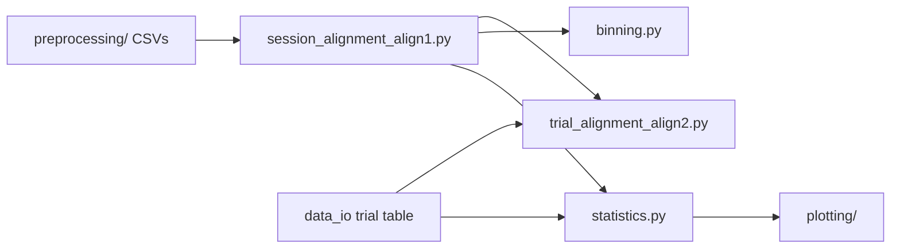
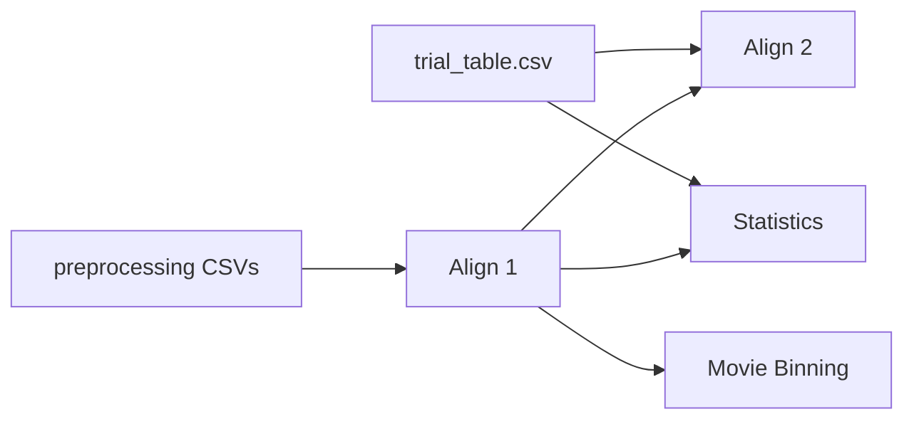

# analysis

> Alignment, binning, and neuron-level statistics for the CNL 24 Python Pipeline Project.

---

# Table of Contents

- [Package Scope](#package-scope)
- [Package Structure](#package-structure)
- [Data Flow](#data-flow)
- [`session_alignment_align1.py`](#session_alignment_align1py)
- [`trial_alignment_align2.py`](#trial_alignment_align2py)
- [`binning.py`](#binningpy)
- [`statistics.py`](#statisticspy)
- [Running the Package](#running-the-package)
- [Testing](#testing)

---

# Package Scope

The `analysis` package turns standardized metadata and per-neuron spike CSVs
into the scientifically meaningful products used by plotting and summary
reporting.

It contains three major steps:

1. Align spikes to the movie/session timebase.
2. Assign movie-aligned spikes to behavioral trial windows and summarize them.
3. Compute neuron-level and population-level statistics.

The package assumes that preprocessing and `data_io` have already produced the
standardized inputs it consumes.

---

# Package Structure

```text
analysis/

├── __init__.py
├── session_alignment_align1.py
├── trial_alignment_align2.py
├── binning.py
├── statistics.py
└── README.md
```

| Module | Responsibility |
|--------|----------------|
| `session_alignment_align1.py` | Align per-unit spike CSVs to the movie/session timebase. |
| `trial_alignment_align2.py` | Assign movie-aligned spikes to trial windows. |
| `binning.py` | Bin Align 1 outputs into fixed-width time windows. |
| `statistics.py` | Compute neuron-level and population-level summary statistics. |

---

# Data Flow



The package is arranged so that each stage consumes the standardized outputs of
the previous stage rather than re-reading raw files or re-deriving upstream
metadata.

---

# `session_alignment_align1.py`

`session_alignment_align1.py` creates Align 1 files by mapping raw per-unit
spike CSVs onto the movie/session timebase.

The module is the first step where spike times are interpreted relative to the
experimental movie window.

## Module Inputs and Outputs

### Inputs

| Input | Description |
|------|-------------|
| `times_manual*_unit_*.csv` | Per-unit CSV files written by preprocessing. |
| `start_unix_0` | Movie start time in Unix seconds. |
| `matLab` | MATLAB reference timestamp in Unix seconds. |
| `duration` | Movie duration in seconds. |

### Outputs

| Output | Description |
|--------|-------------|
| `align1_*.csv` | Session-aligned spike table for each neuron. |

### Output columns

| Column | Description |
|--------|-------------|
| `units` | Neuron/unit identifier. |
| `spikeTimeRawS` | Original spike time in seconds. |
| `movieAlignedTimeS` | Spike time relative to movie onset in seconds. |
| `movieAlignedTimeMs` | Spike time relative to movie onset in milliseconds. |

## `compute_session_window()`

Computes the movie/session start and end times in seconds.

### Inputs

| Parameter | Type | Description |
|-----------|------|-------------|
| `start_unix_0` | `float` | Movie start time in Unix seconds. |
| `matLab` | `float` | MATLAB reference timestamp in Unix seconds. |
| `duration` | `float` | Movie duration in seconds. |

### Returns

| Type | Description |
|------|-------------|
| `tuple[float, float]` | `(session_start_seconds, session_end_seconds)` |

### Implementation

- subtracts the MATLAB reference timestamp from `start_unix_0`
- treats the difference as the movie/session start in seconds
- adds `duration` to compute the movie/session end
- returns the start/end pair without reading any files

The function keeps the session-window calculation isolated so the rest of the
module can reuse a single derived window boundary.

## `load_spike_csv()`

Loads one preprocessing CSV and standardizes the spike-time column name.

### Inputs

| Parameter | Type | Description |
|-----------|------|-------------|
| `spike_csv_path` | `str | Path` | Path to one per-unit spike CSV. |

### Returns

| Type | Description |
|------|-------------|
| `pd.DataFrame` | Standardized DataFrame with `units` and `spikeTimeRawS`. |

### Implementation

- reads the CSV with `pandas.read_csv`
- verifies that `units` and `s` are present
- converts `units` to integer values
- converts `s` to numeric and stores it as `spikeTimeRawS`
- drops rows where the spike time cannot be converted
- returns only the `units` and `spikeTimeRawS` columns

## `align_spikes_to_movie_window()`

Filters spikes to the movie window and re-zeros spike times at movie onset.

### Inputs

| Parameter | Type | Description |
|-----------|------|-------------|
| `spike_df` | `pd.DataFrame` | Raw spike table from `load_spike_csv()`. |
| `session_start_seconds` | `float` | Movie/session start time in seconds. |
| `session_duration_seconds` | `float` | Movie duration in seconds. |

### Returns

| Type | Description |
|------|-------------|
| `pd.DataFrame` | Movie-aligned spike table. |

### Implementation

- returns an empty table with the expected columns when the input is empty
- computes `session_end_seconds` as `session_start_seconds + session_duration_seconds`
- keeps only spikes whose raw spike time falls inside the session window
- subtracts `session_start_seconds` from each retained spike
- stores the result in `movieAlignedTimeS`
- multiplies that value by 1000 to create `movieAlignedTimeMs`
- returns the columns in the expected order

Spikes outside the movie window are discarded rather than clipped.

## `save_aligned_spikes()`

Writes an Align 1 table to disk.

### Inputs

| Parameter | Type | Description |
|-----------|------|-------------|
| `df` | `pd.DataFrame` | Movie-aligned spike table. |
| `output_path` | `str | Path` | Destination CSV path. |

### Returns

| Type | Description |
|------|-------------|
| `Path` | Output path that was written. |

### Implementation

- converts `output_path` to a `Path`
- creates the parent directory if needed
- writes the DataFrame with `to_csv(index=False, float_format="%.4f")`
- returns the output path

## `align_one_neuron()`

Creates one Align 1 file for one neuron.

### Inputs

| Parameter | Type | Description |
|-----------|------|-------------|
| `spike_csv_path` | `str | Path` | One preprocessing CSV. |
| `session_start_seconds` | `float` | Movie/session start time. |
| `session_duration_seconds` | `float` | Movie duration in seconds. |
| `align1_output_dir` | `str | Path` | Directory for Align 1 output files. |

### Returns

| Type | Description |
|------|-------------|
| `Path` | Path to the written `align1_*.csv` file. |

### Implementation

- loads the raw spike CSV
- aligns the spikes to the movie/session window
- constructs the output filename by prefixing `align1_` to the input filename
- writes the aligned table to the output directory
- returns the output path

## `align_session_folder()`

Creates Align 1 files for every preprocessing CSV in one folder.

### Inputs

| Parameter | Type | Description |
|-----------|------|-------------|
| `spike_csv_dir` | `str | Path` | Directory containing `times_manual*_unit_*.csv` files. |
| `session_start_seconds` | `float` | Movie/session start time. |
| `session_duration_seconds` | `float` | Movie duration in seconds. |
| `align1_output_dir` | `str | Path` | Output directory for Align 1 files. |

### Returns

| Type | Description |
|------|-------------|
| `list[Path]` | Paths to all written Align 1 files. |

### Implementation

- scans the folder for files matching `times_manual*_unit_*.csv`
- sorts the file list for deterministic processing
- calls `align_one_neuron()` for each file
- returns the list of written output paths

## `main()`

Command-line entry point for Align 1.

### Inputs

None.

### Returns

| Type | Description |
|------|-------------|
| `int` | Exit code. |

### Implementation

- builds an `argparse.ArgumentParser`
- accepts `--input-dir`, `--output-dir`, `--start-unix-0`, `--matlab`, and `--duration`
- computes the session start from `start_unix_0 - matlab`
- calls `align_session_folder()`
- prints a summary of how many files were written
- returns `0`

---

# `trial_alignment_align2.py`

`trial_alignment_align2.py` creates Align 2 files by assigning movie-aligned
spikes to behavioral trial windows.

The module consumes Align 1 output and the canonical trial table produced by
`data_io`.

## Module Inputs and Outputs

### Inputs

| Input | Description |
|------|-------------|
| `align1_*.csv` | Session-aligned spike table for each neuron. |
| `trial_table.csv` | Canonical behavioral trial table from `data_io`. |

### Outputs

| Output | Description |
|--------|-------------|
| `align2_*.csv` | Trial-aligned spike table for each neuron. |

### Output columns

| Column | Description |
|--------|-------------|
| `units` | Neuron/unit identifier. |
| `spikeTimeRawS` | Original spike time in seconds. |
| `movieAlignedTimeS` | Spike time relative to movie onset in seconds. |
| `movieAlignedTimeMs` | Spike time relative to movie onset in milliseconds. |
| `trialOrder` | Trial order from the canonical trial table. |
| `clipWindowId` | Stable trial/window identifier. |
| `clipID` | Clip identifier. |
| `movieID` | Movie identifier. |
| `isAccurate` | Accuracy label from the trial table. |
| `plotOrder` | Plot ordering label from the trial table. |
| `includeInPlots` | Plot inclusion flag. |
| `clipStartTimeMs` | Trial start time in milliseconds. |
| `clipEndTimeMs` | Trial end time in milliseconds. |
| `spikeTimeRelativeToClipStartMs` | Spike time relative to trial start in milliseconds. |
| `spikeTimeRelativeToClipStartS` | Spike time relative to trial start in seconds. |

## `load_align1_spike_csv()`

Loads one Align 1 file and standardizes its numeric columns.

### Inputs

| Parameter | Type | Description |
|-----------|------|-------------|
| `spike_csv_path` | `str | Path` | Path to one Align 1 CSV. |

### Returns

| Type | Description |
|------|-------------|
| `pd.DataFrame` | Standardized Align 1 DataFrame. |

### Implementation

- reads the CSV
- verifies that `units`, `spikeTimeRawS`, `movieAlignedTimeS`, and `movieAlignedTimeMs` exist
- converts `units` to integers
- converts the timing columns to numeric values
- drops rows where any timing column cannot be converted
- returns only the standardized columns

## `align_spikes_to_trials()`

Assigns each movie-aligned spike to every matching trial window.

### Inputs

| Parameter | Type | Description |
|-----------|------|-------------|
| `movie_aligned_spikes` | `pd.DataFrame` | Align 1 spike table. |
| `trial_table` | `pd.DataFrame` | Canonical behavioral trial table. |

### Returns

| Type | Description |
|------|-------------|
| `pd.DataFrame` | Trial-aligned spike table. |

### Implementation

- returns an empty table with the expected columns when either input is empty
- verifies that the trial table contains `clipStartTimeMs`, `clipEndTimeMs`, and `clipWindowId`
- iterates over each trial row
- selects spikes whose `movieAlignedTimeMs` falls inside the trial window
- creates one output row per matching spike and trial
- computes `spikeTimeRelativeToClipStartMs` by subtracting the trial start time
- computes `spikeTimeRelativeToClipStartS` by dividing the relative milliseconds by 1000
- carries through the trial metadata columns from the canonical trial table
- returns the rows in the fixed output column order

The membership rule is inclusive on both ends of the clip window.

## `save_trial_aligned_spikes()`

Writes an Align 2 table to disk.

### Inputs

| Parameter | Type | Description |
|-----------|------|-------------|
| `df` | `pd.DataFrame` | Trial-aligned spike table. |
| `output_path` | `str | Path` | Destination CSV path. |

### Returns

| Type | Description |
|------|-------------|
| `Path` | Output path that was written. |

### Implementation

- creates the parent output directory if needed
- writes the table with `float_format="%.4f"`
- returns the output path

## `align_one_neuron()`

Creates one Align 2 file for one neuron.

### Inputs

| Parameter | Type | Description |
|-----------|------|-------------|
| `align1_csv_path` | `str | Path` | One Align 1 CSV. |
| `trial_table` | `pd.DataFrame` | Canonical behavioral trial table. |
| `align2_output_dir` | `str | Path` | Destination directory for Align 2 files. |

### Returns

| Type | Description |
|------|-------------|
| `Path` | Path to the written `align2_*.csv` file. |

### Implementation

- loads the Align 1 CSV
- assigns spikes to trial windows
- builds the Align 2 filename by replacing the `align1_` prefix with `align2_`
- writes the trial-aligned table
- returns the output path

## `align_session_folder()`

Creates Align 2 files for every Align 1 file in one folder.

### Inputs

| Parameter | Type | Description |
|-----------|------|-------------|
| `align1_input_dir` | `str | Path` | Folder containing `align1_*.csv` files. |
| `trial_table` | `pd.DataFrame` | Canonical behavioral trial table. |
| `align2_output_dir` | `str | Path` | Destination directory for Align 2 files. |

### Returns

| Type | Description |
|------|-------------|
| `list[Path]` | Paths to all written Align 2 files. |

### Implementation

- scans the input directory for `align1_*.csv`
- sorts the file list
- runs `align_one_neuron()` for each file
- returns the written file paths

## `main()`

Command-line entry point for Align 2.

### Inputs

None.

### Returns

| Type | Description |
|------|-------------|
| `int` | Exit code. |

### Implementation

- creates an argument parser
- accepts `--align1-dir`, `--trial-table`, and `--output-dir`
- loads `trial_table.csv`
- calls `align_session_folder()`
- prints how many neuron files were processed
- returns `0`

---

# `binning.py`

`binning.py` bins movie-aligned spikes from Align 1 into fixed-width firing
rate tables.

The module is intentionally lightweight and works directly from the Align 1
timing column.

## Module Inputs and Outputs

### Inputs

| Input | Description |
|------|-------------|
| `align1_*.csv` | Movie-aligned spike files. |
| `bin_size_s` | Bin width in seconds. Default: `10`. |

### Outputs

| Output | Description |
|--------|-------------|
| `*_binned.csv` | Binned spike-count and firing-rate table. |

## `load_align1_csv()`

Loads one Align 1 file and guarantees that the data contain an `ms` column.

### Inputs

| Parameter | Type | Description |
|-----------|------|-------------|
| `csv_path` | `str | Path` | Path to an Align 1 CSV. |

### Returns

| Type | Description |
|------|-------------|
| `pd.DataFrame` | Align 1 table with a numeric `ms` column. |

### Implementation

- reads the CSV
- if `ms` already exists, keeps it
- otherwise creates `ms` from `movieAlignedTimeMs`
- if that is absent, creates `ms` from `movieAlignedTimeS * 1000`
- raises an error if neither timing column exists
- converts `ms` to numeric
- drops rows where `ms` is missing

## `bin_firing_rate_from_df()`

Bins spike times into fixed-width windows and computes firing rate.

### Inputs

| Parameter | Type | Description |
|-----------|------|-------------|
| `df` | `pd.DataFrame` | Align 1 spike table containing `ms`. |
| `bin_size_s` | `int` | Bin width in seconds. Default: `10`. |

### Returns

| Type | Description |
|------|-------------|
| `pd.DataFrame` | Table with spike counts and firing rates per bin. |

### Implementation

- rejects nonpositive bin sizes
- returns an empty table with the expected columns when the input is empty
- verifies that `ms` exists
- converts spike times from milliseconds to seconds
- uses `np.floor(spike_time / bin_size_s)` to assign each spike to a bin
- counts spikes per bin with `value_counts()`
- fills missing bins with zeros so the output is contiguous
- computes `firing_rate_hz` as `spike_count / bin_size_s`

## `bin_firing_rate()`

Convenience wrapper that bins spikes directly from a CSV path.

### Inputs

| Parameter | Type | Description |
|-----------|------|-------------|
| `csv_path` | `str | Path` | Align 1 CSV path. |
| `bin_size_s` | `int` | Bin width in seconds. |

### Returns

| Type | Description |
|------|-------------|
| `pd.DataFrame` | Binned firing-rate table. |

### Implementation

- loads the CSV using `load_align1_csv()`
- passes the DataFrame to `bin_firing_rate_from_df()`

## `bin_align1_file()`

Writes one binned output file for one Align 1 CSV.

### Inputs

| Parameter | Type | Description |
|-----------|------|-------------|
| `align1_csv_path` | `str | Path` | Input Align 1 file. |
| `output_csv_path` | `str | Path` | Destination path for the binned table. |
| `bin_size_s` | `int` | Bin width in seconds. |

### Returns

| Type | Description |
|------|-------------|
| `Path` | Written output path. |

### Implementation

- creates the output directory if needed
- bins the input CSV
- writes the resulting table to disk
- returns the output path

## `bin_align1_folder()`

Bins every Align 1 CSV in one folder.

### Inputs

| Parameter | Type | Description |
|-----------|------|-------------|
| `align1_dir` | `str | Path` | Directory containing `align1_*.csv`. |
| `output_dir` | `str | Path` | Output directory. |
| `bin_size_s` | `int` | Bin width in seconds. |

### Returns

| Type | Description |
|------|-------------|
| `list[Path]` | Paths to all written binned CSVs. |

### Implementation

- creates the output directory if needed
- scans for files matching `align1_*.csv`
- sorts the file list
- writes output files named `*_binned_{bin_size_s}s.csv`
- returns the written paths

## `main()`

Command-line entry point for binning.

### Inputs

None.

### Returns

| Type | Description |
|------|-------------|
| `int` | Exit code. |

### Implementation

- accepts `--align1-dir`, `--output-dir`, and `--bin-size-s`
- runs `bin_align1_folder()`
- prints how many files were written
- returns `0`

---

# `statistics.py`

`statistics.py` computes the neuron-level and population-level summary tables
used by plotting.

The module reads Align 1 outputs and the canonical trial table, then computes
per-neuron statistics over the pre-stimulus and post-stimulus windows.

## Module Inputs and Outputs

### Inputs

| Input | Description |
|------|-------------|
| `align1_*.csv` | Movie-aligned spike files. |
| Canonical trial table | Behavioral timing and trial metadata from `data_io`. |

### Outputs

| Output | Description |
|--------|-------------|
| `neuron_summary.csv` | Per-neuron summary table. |
| Population summary dicts | Statistical summaries used for reporting. |

### Default windows and thresholds

| Name | Value |
|------|------|
| `DEFAULT_PRE_WINDOW_MS` | `(-1000, 0)` |
| `DEFAULT_POST_WINDOW_MS` | `(200, 1200)` |
| `DEFAULT_MIN_RATE_HZ` | `0.25` |
| `DEFAULT_ALPHA` | `0.05` |
| `DEFAULT_SIG_T_SCORE` | `1.96` |

## `load_clip_table()`

Loads and standardizes the canonical trial table for statistics.

### Inputs

| Parameter | Type | Description |
|-----------|------|-------------|
| `csv_path` | `str | Path` | Path to the canonical trial table. |

### Returns

| Type | Description |
|------|-------------|
| `pd.DataFrame` | Standardized trial table. |

### Implementation

- reads the CSV
- strips whitespace from column names
- renames canonical columns into the legacy-style names expected by the rest of the module:
  - `clipStartTimeMs` → `ms start`
  - `clipEndTimeMs` → `ms end`
  - `isAccurate` → `Accurate`
  - `plotOrder` → `Plot Y-Axis`
  - `includeInPlots` → `Plot Toggle`
- converts timing and plotting columns to numeric values
- fills missing `Accurate` values with `0`
- fills missing `Plot Toggle` values with `1`

This keeps statistics compatible with the historical plotting and summary logic.

## `_load_align1_for_stats()`

Loads Align 1 data in either DataFrame or CSV form and guarantees an `ms` column.

### Inputs

| Parameter | Type | Description |
|-----------|------|-------------|
| `df_or_path` | `pd.DataFrame | str | Path` | Align 1 data source. |

### Returns

| Type | Description |
|------|-------------|
| `pd.DataFrame` | Align 1 table with a numeric `ms` column. |

### Implementation

- reads the CSV if a path is supplied
- copies the DataFrame if one is supplied directly
- creates `ms` from `movieAlignedTimeMs` when needed
- otherwise creates `ms` from `movieAlignedTimeS * 1000`
- raises an error if neither timing column exists
- converts `ms` to numeric
- drops rows without valid `ms` values

## `compute_rate_hz_in_window()`

Computes the average firing rate inside a time window across clips.

### Inputs

| Parameter | Type | Description |
|-----------|------|-------------|
| `spikes_ms` | `np.ndarray` | Spike times in milliseconds. |
| `clips_df` | `pd.DataFrame` | Trial table with `ms start` values. |
| `win_start` | `int` | Window start relative to clip onset in ms. |
| `win_end` | `int` | Window end relative to clip onset in ms. |

### Returns

| Type | Description |
|------|-------------|
| `Optional[float]` | Average firing rate in Hz, or `None` when not computable. |

### Implementation

- computes the window duration in seconds
- returns `None` when the duration is nonpositive or the clip table is empty
- iterates over each clip row
- skips clips without a valid `ms start`
- converts the relative window into absolute spike-time boundaries
- counts spikes inside the absolute window for each valid clip
- averages across the number of valid clips and the window duration

## `compute_correct_vs_wrong_ttest()`

Compares firing rates in correct and incorrect trials.

### Inputs

| Parameter | Type | Description |
|-----------|------|-------------|
| `spikes_ms` | `np.ndarray` | Spike times in milliseconds. |
| `clips_df` | `pd.DataFrame` | Trial table with `Accurate` values. |
| `window_start_ms` | `int` | Window start relative to clip onset. |
| `window_end_ms` | `int` | Window end relative to clip onset. |
| `alpha` | `float` | Significance threshold. |
| `significance_method` | `str` | Either `p_value` or `t_score`. |

### Returns

| Type | Description |
|------|-------------|
| `dict[str, object]` | Dictionary containing t-test results and significance. |

### Implementation

- splits clips into correct and incorrect groups using the `Accurate` column
- computes a firing rate for each clip in the requested window
- requires at least two rates in each group
- runs Welch’s two-sample t-test with `ttest_ind(..., equal_var=False)`
- marks significance using either:
  - `p_value < alpha`, or
  - `abs(t_stat) >= DEFAULT_SIG_T_SCORE`
- returns a dictionary containing the test result, group sizes, and significance flag

## `build_neuron_summary_row()`

Builds one row of the neuron summary table.

### Inputs

| Parameter | Type | Description |
|-----------|------|-------------|
| `align1_df` | `pd.DataFrame` | Align 1 table for one neuron. |
| `clips_df` | `pd.DataFrame` | Canonical trial table. |
| `neuron_name` | `str` | Neuron file name without the `align1_` prefix. |
| `patient_id` | `str` | Patient identifier. |
| `output_tag` | `str` | Optional tag appended to the patient label. |
| `min_rate_hz` | `float` | Minimum post-stimulus mean firing rate. |
| `pre_window_ms` | `tuple[int, int]` | Pre-stimulus analysis window. |
| `post_window_ms` | `tuple[int, int]` | Post-stimulus analysis window. |
| `alpha` | `float` | Significance threshold. |
| `significance_method` | `str` | `p_value` or `t_score`. |

### Returns

| Type | Description |
|------|-------------|
| `Optional[dict]` | Summary row, or `None` when the neuron does not meet criteria. |

### Implementation

- returns `None` when the Align 1 table is empty
- loads Align 1 data into a numeric `ms` representation
- returns `None` when no valid spike times remain
- computes post-stimulus mean firing rate
- returns `None` when the post-stimulus rate is below `min_rate_hz`
- computes pre-stimulus and post-stimulus correct-vs-wrong t-tests
- extracts t-statistics, p-values, and significance flags
- builds a summary dictionary containing:
  - patient label
  - neuron name
  - pre/post t-scores and p-values
  - pre/post significance flags
  - `T-Score Diff (Pre - Post)`
  - `Post-Stim Mean Rate (Hz)`
  - number of clips

## `analyze_align1_file()`

Analyzes one Align 1 file.

### Inputs

| Parameter | Type | Description |
|-----------|------|-------------|
| `align1_csv_path` | `str | Path` | Align 1 CSV path. |
| `clips_df` | `pd.DataFrame` | Canonical trial table. |
| `patient_id` | `str` | Patient identifier. |
| `output_tag` | `str` | Optional tag appended to the patient label. |
| `min_rate_hz` | `float` | Minimum post-stimulus firing rate. |
| `pre_window_ms` | `tuple[int, int]` | Pre-stimulus window. |
| `post_window_ms` | `tuple[int, int]` | Post-stimulus window. |
| `alpha` | `float` | Significance threshold. |
| `significance_method` | `str` | `p_value` or `t_score`. |

### Returns

| Type | Description |
|------|-------------|
| `Optional[dict]` | Summary row for one neuron, or `None`. |

### Implementation

- reads the Align 1 CSV
- derives the neuron name from the file name
- passes the data to `build_neuron_summary_row()`

## `analyze_align1_folder()`

Analyzes every Align 1 file in a folder and writes the summary table.

### Inputs

| Parameter | Type | Description |
|-----------|------|-------------|
| `align1_dir` | `str | Path` | Folder containing `align1_*.csv`. |
| `clips_df` | `pd.DataFrame` | Canonical trial table. |
| `patient_id` | `str` | Patient identifier. |
| `output_csv` | `str | Path` | Destination for `neuron_summary.csv`. |
| `output_tag` | `str` | Optional tag appended to the patient label. |
| `min_rate_hz` | `float` | Minimum post-stimulus rate. |
| `pre_window_ms` | `tuple[int, int]` | Pre-stimulus window. |
| `post_window_ms` | `tuple[int, int]` | Post-stimulus window. |
| `alpha` | `float` | Significance threshold. |
| `significance_method` | `str` | `p_value` or `t_score`. |

### Returns

| Type | Description |
|------|-------------|
| `pd.DataFrame` | Final neuron summary table. |

### Implementation

- scans the folder for `align1_*.csv`
- sorts the file list
- analyzes each file with `analyze_align1_file()`
- collects non-`None` rows into a list
- writes the resulting DataFrame to `output_csv`
- returns the DataFrame

## `population_chisq_vs_chance()`

Runs a chi-square test comparing significant and non-significant neurons
against a chance expectation.

### Inputs

| Parameter | Type | Description |
|-----------|------|-------------|
| `df` | `pd.DataFrame` | Summary table. |
| `metric_col` | `str` | Metric column to examine. |
| `thresh` | `Optional[float]` | Threshold used when `sig_col` is absent. |
| `sig_col` | `Optional[str]` | Boolean significance column. |

### Returns

| Type | Description |
|------|-------------|
| `dict` | Population summary dictionary. |

### Implementation

- removes rows with missing metric values
- counts the number of positive and negative significant values
- uses `sig_col` when available
- otherwise uses `thresh`
- compares the significant count against a 5% expected rate
- returns mean, SEM, counts, expected counts, chi-square statistic, and p-value

## `population_chisq_vs_5050()`

Runs a chi-square test against a 50/50 split.

### Inputs

| Parameter | Type | Description |
|-----------|------|-------------|
| `df` | `pd.DataFrame` | Summary table. |
| `metric_col` | `str` | Metric column to examine. |

### Returns

| Type | Description |
|------|-------------|
| `dict` | Population summary dictionary. |

### Implementation

- removes missing metric rows
- counts positive, negative, and exact-zero values
- ignores exact zeros when computing the expected 50/50 split
- runs chi-square on the positive and negative counts
- returns summary statistics and the test result

## `population_one_sample_ttest()`

Runs a one-sample t-test against a population mean.

### Inputs

| Parameter | Type | Description |
|-----------|------|-------------|
| `df` | `pd.DataFrame` | Summary table. |
| `metric_col` | `str` | Metric column to examine. |
| `popmean` | `float` | Population mean for the test. |

### Returns

| Type | Description |
|------|-------------|
| `dict` | Population summary dictionary. |

### Implementation

- removes missing metric rows
- converts the selected metric to numeric values
- returns early when there are fewer than two valid samples
- runs `ttest_1samp`
- returns the sample size, mean, SEM, t-statistic, p-value, and population mean

## `analyze_population_table()`

Chooses the population-level test to run.

### Inputs

| Parameter | Type | Description |
|-----------|------|-------------|
| `summary_csv` | `str | Path` | Path to the neuron summary table. |
| `metric_col` | `str` | Metric column to analyze. |
| `test_mode` | `str` | One of `chisq_vs_chance`, `chisq_vs_5050`, or `one_sample_ttest`. |
| `thresh` | `Optional[float]` | Threshold used by `chisq_vs_chance`. |
| `sig_col` | `Optional[str]` | Boolean significance column. |
| `popmean` | `float` | Population mean for the t-test. |

### Returns

| Type | Description |
|------|-------------|
| `dict` | Population summary dictionary. |

### Implementation

- reads the summary CSV
- dispatches to the requested test helper
- raises `ValueError` for an unknown test mode

## `main()`

Command-line entry point for statistics.

### Inputs

None.

### Returns

| Type | Description |
|------|-------------|
| `int` | Exit code. |

### Implementation

- accepts `--align1-dir`, `--clips-table`, `--patient-id`, and `--output-csv`
- accepts analysis parameters for windows, alpha, and significance method
- accepts population-test parameters
- loads the canonical trial table
- runs `analyze_align1_folder()`
- prints how many neuron summary rows were written
- computes and prints a population summary from `T-Score Diff (Pre - Post)`
- returns `0`

---

---

# Running the Package

Although the complete repository is normally executed through
`running/setup_and_run.py`, each analysis module can also be run
independently.

This is useful when debugging a single stage of the pipeline or regenerating
only one class of outputs.

## Align 1

Generates movie/session-aligned spike tables from the preprocessing CSV files.

```bash
python analysis/session_alignment_align1.py \
    --input-dir preprocessing_output \
    --output-dir align1 \
    --start-unix-0 <movie_start_unix_seconds> \
    --matlab <matlab_reference_seconds> \
    --duration <movie_duration_seconds>
```

Output:

```text
align1/
    align1_times_manual_*_unit_#.csv
```

---

## Align 2

Assigns Align 1 spikes to behavioral trial windows.

```bash
python analysis/trial_alignment_align2.py \
    --align1-dir align1 \
    --trial-table trial_table.csv \
    --output-dir align2
```

Output:

```text
align2/
    align2_times_manual_*_unit_#.csv
```

---

## Movie Binning

Bins movie-aligned spike trains into fixed-width windows.

```bash
python analysis/binning.py \
    --align1-dir align1 \
    --output-dir binning \
    --bin-size-s 10
```

Output:

```text
binning/
    *_binned_10s.csv
```

---

## Statistics

Computes neuron-level statistical summaries from the Align 1 outputs and the
canonical trial table.

```bash
python analysis/statistics.py \
    --align1-dir align1 \
    --clips-table trial_table.csv \
    --patient-id P570 \
    --output-csv neuron_summary.csv
```

Output:

```text
statistics/
    neuron_summary.csv
```

---

## Typical Workflow



Each analysis stage can be executed independently for debugging, although a
normal pipeline run performs these steps automatically through
`running/pipeline_executor.py`.

# Testing

The analysis package is covered by the repository test suite.

The tests should verify that:

- Align 1 produces one output file per input neuron
- Align 1 removes spikes outside the session window
- Align 2 assigns spikes to trial windows correctly
- Align 2 preserves the canonical trial metadata columns
- binning produces contiguous fixed-width bins
- statistics builds neuron summary rows only when the post-stimulus rate threshold is met
- population summary helpers return the expected dictionary structure
- the CLI entry points run successfully on valid input

The package is intentionally structured so each module can be validated
independently before combining it with the plotting layer.
