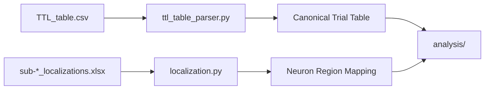

# data_io

> Standardized behavioral metadata and anatomical localization for the CNL 24 Python Pipeline Project.

---

# Table of Contents

- [Package Scope](#package-scope)
- [Package Structure](#package-structure)
- [`ttl_table_parser.py`](#ttl_table_parserpy)
  - [Module Inputs and Outputs](#module-inputs-and-outputs)
  - [`load_ttl_table()`](#load_ttl_table)
  - [`filter_trials()`](#filter_trials)
  - [`derive_timing_columns()`](#derive_timing_columns)
  - [`_infer_accuracy()`](#_infer_accuracy)
  - [`derive_analysis_columns()`](#derive_analysis_columns)
  - [`restore_plot_preferences()`](#restore_plot_preferences)
  - [`save_trial_table()`](#save_trial_table)
  - [`build_trial_table()`](#build_trial_table)
  - [`main()`](#main)
- [`localization.py`](#localizationpy)
  - [Module Inputs and Outputs](#module-inputs-and-outputs-1)
  - [`BIPOLAR_REGIONS`](#bipolar_regions)
  - [`load_localization_map()`](#load_localization_map)
  - [`_infer_electrode_abbr_from_filename()`](#_infer_electrode_abbr_from_filename)
  - [`_find_matching_row()`](#_find_matching_row)
  - [`_pick_region_abbr()`](#_pick_region_abbr)
  - [`infer_neuron_localization()`](#infer_neuron_localization)
  - [`region_description()`](#region_description)
- [Testing](#testing)

---

# Package Scope

`data_io` turns raw experimental metadata into the standardized inputs used by
the rest of the repository.

The package has two responsibilities:

1. convert the raw TTL/behavioral export into a canonical trial table
2. infer neuron localization from the localization workbook

The package does not perform spike alignment, statistics, or plotting.
It only prepares metadata for downstream stages.

---

# Package Structure

```text
data_io/

├── __init__.py
├── ttl_table_parser.py
├── localization.py
└── README.md
```

| Module | Responsibility |
|--------|----------------|
| `ttl_table_parser.py` | Read, filter, and standardize behavioral timing metadata. |
| `localization.py` | Read localization workbooks and infer region labels from neuron filenames. |



---

# `ttl_table_parser.py`

`ttl_table_parser.py` converts the raw TTL table into the standardized trial
table used by alignment, statistics, and plotting.

The module preserves the raw experimental columns and adds derived columns that
are used by the rest of the pipeline.

## Module Inputs and Outputs

### Raw input columns preserved by the parser

The module keeps the following raw columns when they are present:

- `experimentPhase`
- `trialNumber`
- `movieID`
- `clipID`
- `response`
- `reactionTimePTB`
- `trialStartTimePTB`
- `trialEndTimePTB`
- `clipStartTime`
- `clipEndTime`
- `frameOn`
- `frameOff`
- `startTag`
- `cueEndTag`
- `endTag`
- `startTimeUnixSec`
- `cueEndTimeUnixSec`
- `endTimeUnixSec`
- `startTimeMat`
- `cueEndTimeMat`
- `endTimeMat`
- `trialNumberMat`

### Derived columns added by the parser

The parser may add these columns:

- `clipStartTimeMs`
- `clipEndTimeMs`
- `clipDurationMs`
- `clipDurationSec`
- `clipFrameRange`
- `clipTimeRangeMs`
- `clipWindowId`
- `isAccurate`
- `trialOrder`
- `plotOrder`
- `includeInPlots`

## `load_ttl_table()`

Reads the raw TTL / behavioral table into a DataFrame.

### Inputs

| Parameter | Type | Description |
|-----------|------|-------------|
| `ttl_csv` | `str | Path` | Path to the raw CSV file. |

### Returns

| Type | Description |
|------|-------------|
| `pd.DataFrame` | The raw table with whitespace stripped from the column names. |

### Implementation

- converts the path to a `Path`
- reads the CSV with `pandas.read_csv`
- strips whitespace from every column name
- returns the DataFrame unchanged otherwise

## `filter_trials()`

Selects the subset of rows used for analysis.

### Inputs

| Parameter | Type | Description |
|-----------|------|-------------|
| `df` | `pd.DataFrame` | Raw TTL table. |
| `phase` | `str` | `experimentPhase` value to keep. Default: `recog_task`. |
| `movie_id` | `Optional[int]` | `movieID` value to keep. If `None`, all movie IDs are kept. |

### Returns

| Type | Description |
|------|-------------|
| `pd.DataFrame` | Filtered trial table with the index reset. |

### Implementation

- copies the input table
- filters to rows where `experimentPhase == phase` when that column exists
- filters to the requested `movieID` when `movie_id` is not `None`
- converts `movieID` to numeric before comparing
- resets the index before returning

## `derive_timing_columns()`

Adds the canonical timing columns derived from `clipStartTime` and `clipEndTime`.

> [!IMPORTANT]
> `drift_rate_slope` scales `clipStartTime` and `clipEndTime` by `1 + drift_rate_slope` before `clipStartTimeMs`, `clipEndTimeMs`, and the duration columns are derived.

### Inputs

| Parameter | Type | Description |
|-----------|------|-------------|
| `df` | `pd.DataFrame` | Filtered TTL table. |

### Returns

| Type | Description |
|------|-------------|
| `pd.DataFrame` | Table with timing columns added. |

### Added columns

| Column | Description |
|--------|-------------|
| `clipStartTimeMs` | Clip start time in milliseconds. |
| `clipEndTimeMs` | Clip end time in milliseconds. |
| `clipDurationMs` | `clipEndTimeMs - clipStartTimeMs`. |
| `clipDurationSec` | `clipEndTime - clipStartTime`. |
| `clipFrameRange` | Frame range string when `frameOn` and `frameOff` exist. |
| `clipTimeRangeMs` | Start/end range in milliseconds as a string. |
| `clipWindowId` | Stable identifier built from movie ID plus time range. |

### Implementation

- copies the input table
- checks that `clipStartTime` and `clipEndTime` are present
- converts both columns to numeric
- drops rows where either timing field is missing
- raises `ValueError` if every row is dropped
- computes millisecond start and end times by multiplying seconds by 1000 and rounding
- computes duration columns in both milliseconds and seconds
- when `frameOn` and `frameOff` both exist:
  - converts them to numeric
  - rounds them
  - builds `clipFrameRange` as `frameOn-frameOff`
- builds `clipTimeRangeMs` as `clipStartTimeMs-clipEndTimeMs`
- builds `clipWindowId` as `movieID-clipTimeRangeMs` when `movieID` exists
- otherwise uses `clipTimeRangeMs` alone

## `_infer_accuracy()`

Infers the `isAccurate` column.

### Inputs

| Parameter | Type | Description |
|-----------|------|-------------|
| `df` | `pd.DataFrame` | Behavioral table after filtering. |

### Returns

| Type | Description |
|------|-------------|
| `pd.Series` | Integer series containing 0 or 1 values. |

### Implementation

The function checks for accuracy in this order:

1. use an existing `Accurate` or `Accuracy` column if present
2. otherwise infer accuracy from `response == 2`
3. otherwise return zeros for every row

When a pre-existing accuracy column is used, values are coerced to numeric,
missing values are filled with zero, and the result is converted to integers.

When accuracy is inferred from `response`, the function:

- converts responses to strings
- removes trailing `.0`
- strips whitespace
- compares against the string `"2"`
- converts the resulting boolean mask to integers

## `derive_analysis_columns()`

Adds analysis-only columns used later by the repository.

### Inputs

| Parameter | Type | Description |
|-----------|------|-------------|
| `df` | `pd.DataFrame` | Table after timing columns have been added. |

### Returns

| Type | Description |
|------|-------------|
| `pd.DataFrame` | Table with analysis columns added. |

### Added columns

| Column | Description |
|--------|-------------|
| `isAccurate` | Binary accuracy label. |
| `trialOrder` | Row order from 1 to `len(df)`. |
| `plotOrder` | Plotting order with accurate trials listed before inaccurate trials. |
| `includeInPlots` | Boolean flag defaulting to `True`. |

### Implementation

- copies the input table
- computes `isAccurate` by calling `_infer_accuracy()`
- assigns `trialOrder` using `range(1, len(df) + 1)`
- creates boolean masks for accurate and inaccurate rows
- assigns `plotOrder` so accurate rows are numbered first and inaccurate rows follow
- converts `plotOrder` to integer type
- initializes `includeInPlots` to `True` for all rows

## `restore_plot_preferences()`

Restores `includeInPlots` values from a previous trial table when available.

### Inputs

| Parameter | Type | Description |
|-----------|------|-------------|
| `df` | `pd.DataFrame` | Newly generated trial table. |
| `previous_table` | `Optional[str | Path]` | Path to a previous trial table whose `includeInPlots` values should be reused. |

### Returns

| Type | Description |
|------|-------------|
| `pd.DataFrame` | Table with `includeInPlots` restored when possible. |

### Implementation

- returns the input table unchanged when `previous_table` is `None`
- returns the input table unchanged when the previous file does not exist
- attempts to read the previous table with `pandas.read_csv`
- checks that both `clipWindowId` and `includeInPlots` exist in the previous table
- checks that `clipWindowId` exists in the new table
- builds a mapping from `clipWindowId` to `includeInPlots`
- maps those values onto the new table
- fills unmatched rows with their current `includeInPlots` values
- converts the final result to boolean
- prints a warning if reading or mapping fails

## `save_trial_table()`

Writes the standardized trial table to disk.

### Inputs

| Parameter | Type | Description |
|-----------|------|-------------|
| `df` | `pd.DataFrame` | Standardized trial table. |
| `output_csv` | `str | Path` | Output CSV path. |

### Returns

| Type | Description |
|------|-------------|
| `Path` | Resolved output path. |

### Implementation

- converts `output_csv` to a `Path`
- writes the DataFrame with `to_csv(index=False)`
- returns the output path

## `build_trial_table()`

Runs the full parser pipeline.

### Inputs

| Parameter | Type | Description |
|-----------|------|-------------|
| `ttl_csv` | `str | Path` | Raw TTL CSV path. |
| `output_csv` | `str | Path` | Output CSV path. |
| `phase` | `str` | Experimental phase to keep. Default: `recog_task`. |
| `movie_id` | `Optional[int]` | Movie ID to keep. If `None`, all movie IDs are kept. |
| `previous_table` | `Optional[str | Path]` | Optional prior trial table for restoring plot preferences. |
| `drift_rate_slope` | `float` | Optional video drift estimate applied during timing standardization. Default: `0.0`. |
### Returns

| Type | Description |
|------|-------------|
| `tuple[pd.DataFrame, Path]` | Final table and the file it was written to. |

### Implementation

- loads the raw TTL table
- filters rows by experimental phase and movie ID
- derives timing columns
- derives analysis columns
- restores `includeInPlots` if a previous table is supplied
- writes the final table to disk
- returns both the in-memory table and the output path

## `main()`

Provides the command-line entry point for the parser.

### Inputs

None.

### Returns

None.

### Implementation

- creates an `argparse.ArgumentParser`
- accepts positional `ttl_csv`
- accepts optional `--output-csv`
- accepts optional `--phase`
- accepts optional `--movie-id`
- accepts optional `--previous-table`
- converts `--movie-id -1` into `None`
- calls `build_trial_table()`
- prints the number of rows written and the output path

---

# `localization.py`

`localization.py` reads localization metadata and infers a neuron's anatomical
label from its filename.

The module is small by design and avoids any spike, trial, or statistics logic.

## Module Inputs and Outputs

### Inputs

| Input | Description |
|------|-------------|
| `sub-*_localizations.xlsx` | Localization workbook. |
| Neuron filename | Used to infer the electrode abbreviation. |

### Outputs

| Output | Description |
|--------|-------------|
| Localization DataFrame | Cleaned workbook rows after loading. |
| `(electrode_code, full_location_name, region_abbr)` | Localization tuple for a single neuron. |
| Region description | Human-readable label for a region abbreviation. |

## `BIPOLAR_REGIONS`

Maps region abbreviations to human-readable labels.

### Contents

| Abbreviation | Description |
|--------------|-------------|
| `AMY` | amygdala |
| `BAS` | basal ganglia (putamen, pallidum) |
| `CC` | anterior cingulate cortex |
| `CENT` | pre-/para/POST-central (motor) cortex |
| `ERC` | entorhinal cortex |
| `FC` | frontal cortex (includes SFG, MFG, IFG, OFC) |
| `FUS` | fusiform cortex |
| `HPC` | hippocampus |
| `INS` | insula |
| `LTC` | lateral temporal cortex (includes STG, MTG, IFG, banksSTS and TP) |
| `MCC` | to differentiate from ACC (includes MCC and PCC) |
| `PARS` | pars orbitalis/triangularis/opercularis |
| `PC` | parietal cortex (precuneus, inferiorparietal, somatosensory, supramarginal) |
| `PHC` | parahippocampal gyrus (parahippocampal, perirhinal) |
| `UNKNOWN` | Unknown |
| `VIS` | visual cortex (includes lingual, pericalcarine, cuneus) |
| `WM` | white matter |

## `load_localization_map()`

Loads the localization workbook and keeps only microelectrode rows when the
expected column exists.

### Inputs

| Parameter | Type | Description |
|-----------|------|-------------|
| `file_path` | `str | Path` | Path to the Excel workbook. |

### Returns

| Type | Description |
|------|-------------|
| `pd.DataFrame` | Cleaned localization table. |

### Implementation

- converts the path to a `Path`
- checks whether the file exists
- prints a warning and returns an empty DataFrame if the file is missing
- loads the Excel workbook with `pandas.read_excel`
- strips whitespace from all column names
- when an `electrode` column exists:
  - keeps only rows whose `electrode` value contains `"micro"` case-insensitively
  - copies the filtered rows

## `_infer_electrode_abbr_from_filename()`

Extracts the electrode abbreviation from a neuron filename.

### Inputs

| Parameter | Type | Description |
|-----------|------|-------------|
| `neuron_filename` | `str` | Filename of a neuron CSV or Align 1 file. |

### Returns

| Type | Description |
|------|-------------|
| `str` | Uppercase electrode abbreviation or `UNKNOWN`. |

### Implementation

- searches for a hyphen followed by letters
- returns the first such group in uppercase when found
- otherwise searches for an initial letters-plus-digits pattern
- returns that letters portion in uppercase when found
- otherwise returns `UNKNOWN`

## `_find_matching_row()`

Finds the localization row whose `electrode` value matches the inferred
abbreviation.

### Inputs

| Parameter | Type | Description |
|-----------|------|-------------|
| `loc_df` | `pd.DataFrame` | Localization table. |
| `abbr` | `str` | Inferred electrode abbreviation. |

### Returns

| Type | Description |
|------|-------------|
| `pd.DataFrame` | Matching rows, or an empty DataFrame if none match. |

### Implementation

- returns an empty DataFrame if the localization table is empty
- returns an empty DataFrame if no `electrode` column exists
- uppercases the `electrode` column
- first searches for rows whose electrode value starts with `abbr + "_" `
- if no rows match, searches for rows whose electrode value contains `abbr`
- returns the matching rows

## `_pick_region_abbr()`

Extracts the region abbreviation from a matched localization row.

### Inputs

| Parameter | Type | Description |
|-----------|------|-------------|
| `row` | `pd.Series` | Matched localization row. |
| `loc_df` | `pd.DataFrame` | Full localization table, used to inspect column names. |

### Returns

| Type | Description |
|------|-------------|
| `str` | Region abbreviation or `UNKNOWN`. |

### Implementation

- looks for columns whose name contains `"bipolar"`
- if such a column exists:
  - reads the first bipolar column from the row
  - strips whitespace
  - converts the value to uppercase
  - returns `UNKNOWN` if the value is empty
- if no bipolar column exists:
  - scans columns whose name contains `"region"`
  - applies the same cleanup and fallback logic
- returns `UNKNOWN` if no matching column is found

## `infer_neuron_localization()`

Infers localization for one neuron.

### Inputs

| Parameter | Type | Description |
|-----------|------|-------------|
| `neuron_filename` | `str` | Filename of the neuron CSV or Align 1 file. |
| `loc_df` | `pd.DataFrame` | Localization table loaded by `load_localization_map()`. |

### Returns

| Type | Description |
|------|-------------|
| `tuple[str, str, str]` | `(electrode_code, full_location_name, region_abbr)` |

### Implementation

- returns `("Unknown", "Unknown Location", "UNKNOWN")` when the localization table is empty
- infers the electrode abbreviation from the filename
- finds matching localization rows
- returns the inferred abbreviation, `"Unknown Location"`, and `"UNKNOWN"` when no row matches
- otherwise:
  - takes the first matching row
  - reads `aparc+aseg` for the full location name, defaulting to `"Unknown Location"`
  - extracts the region abbreviation with `_pick_region_abbr()`
  - returns the three-part tuple

## `region_description()`

Converts a region abbreviation to a readable label.

### Inputs

| Parameter | Type | Description |
|-----------|------|-------------|
| `region_abbr` | `str` | Region abbreviation. |

### Returns

| Type | Description |
|------|-------------|
| `str` | Human-readable region label or `Unknown`. |

### Implementation

- uppercases the input abbreviation
- looks up the value in `BIPOLAR_REGIONS`
- returns `Unknown` when the abbreviation is not present

---

# Testing

The package is covered by unit tests in `unit_tests/test_ttl_table_parser.py` and `unit_tests/test_localization.py`.

The tests verify that:

- `build_trial_table()` filters the TTL table correctly
- raw TTL metadata is preserved in the trial table
- derived timing columns are created correctly
- `response == 2` becomes `isAccurate == 1`
- `clipWindowId` is built from the time window
- `includeInPlots` defaults to `True`
- previous `includeInPlots` settings can be restored from an earlier trial table
- `infer_neuron_localization()` returns strings
- `region_description()` resolves known abbreviations and falls back to `Unknown`

The test fixtures mirror the structure of the real project inputs, including
the recognition-task filtering behavior and the localization workbook column
names.
