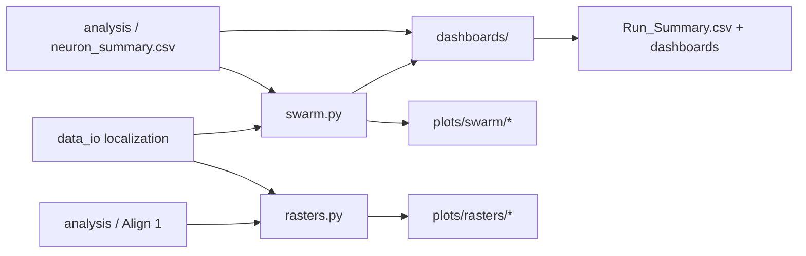
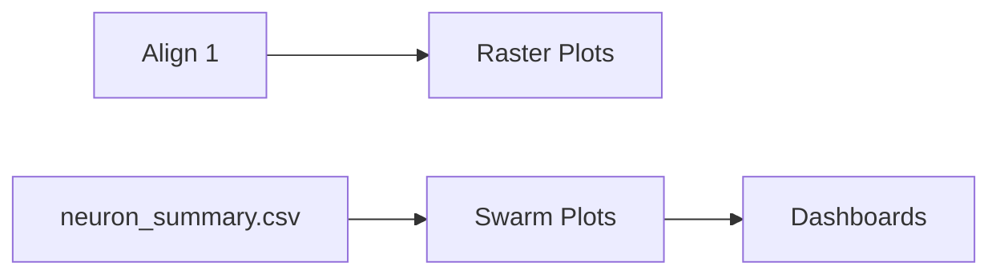

# plotting

> Figure generation layer for rasters, PSTHs, swarm plots, and summary dashboards.

---

# Table of Contents

- [Package Scope](#package-scope)
- [Package Structure](#package-structure)
- [Data Flow](#data-flow)
- [`rasters.py`](#rasterspy)
- [`swarm.py`](#swarmpy)
- [`summary_figures.py`](#summary_figurespy)
- [Testing](#testing)

---

# Package Scope

The `plotting` package turns standardized analysis outputs into PNG figures and
CSV companions.

It sits after preprocessing, `data_io`, and `analysis`. The package does not
perform spike alignment or statistical inference itself; instead, it consumes
canonical Align 1 outputs, summary tables, and localization metadata that have
already been standardized elsewhere in the repository.

The package is responsible for three presentation layers:

1. neuron-level raster and PSTH figures
2. population-level swarm plots and regional summaries
3. dashboard-style composites and run summaries

---

# Package Structure

```text
plotting/

├── __init__.py
├── rasters.py
├── swarm.py
├── summary_figures.py
└── README.md
```

| Module | Responsibility |
|--------|----------------|
| `rasters.py` | Draw raster plots and PSTHs from Align 1 outputs. |
| `swarm.py` | Draw population swarm plots and regional summaries. |
| `summary_figures.py` | Assemble dashboards and final summary outputs. |

---

# Data Flow



The package is structured so that each module consumes stable upstream outputs
and writes a clearly defined set of figures or companion CSV files.

---

# `rasters.py`

`rasters.py` recreates the legacy single-neuron raster and PSTH figures from
movie/session-aligned spike data.

The module works from Align 1 CSVs and the canonical clip table. When a neuron
summary CSV is available, it uses that summary to label figures, filter low-rate
neurons, and route outputs into significance-based and region-based folders.

## Inputs and Outputs

### Primary inputs

| Input | Description |
|------|-------------|
| `align1_*.csv` | Movie/session-aligned spike files from `analysis.session_alignment_align1`. |
| `trial_table.csv` or legacy clip table | Standardized clip timing table. |

### Optional inputs

| Input | Description |
|------|-------------|
| Localization workbook | Used to infer region labels for neuron titles and folder routing. |
| `neuron_summary.csv` | Used for significance labels, rate filtering, and companion CSVs. |

### Outputs

| Output | Description |
|--------|-------------|
| `plots/rasters/all/*.png` | One PNG per plotted neuron. |
| `plots/rasters/sig/*.png` | Mirrored copies of significant neurons. |
| `plots/rasters/nonsig/*.png` | Mirrored copies of non-significant neurons. |
| `plots/rasters/by_region/<region>/*.png` | Region-mirrored copies. |
| `T_score_sheet.csv` | Companion summary CSVs for raster folders. |

### Expected input columns

| Source | Required columns |
|--------|------------------|
| Align 1 CSV | `movieAlignedTimeMs` or `movieAlignedTimeS` or `ms`, plus `units` when available |
| Trial table | `ms start` / `clipStartTimeMs`, `ms end` / `clipEndTimeMs`, `Accurate` / `isAccurate`, `Plot Y-Axis` / `plotOrder`, `Plot Toggle` / `includeInPlots` |

## `load_align1_csv()`

Loads an Align 1 CSV and normalizes its timing columns.

### Inputs

| Parameter | Type | Description |
|-----------|------|-------------|
| `csv_path` | `str | Path` | Path to one Align 1 CSV. |

### Returns

| Type | Description |
|------|-------------|
| `pd.DataFrame` | Standardized Align 1 spike table. |

### Implementation

- reads the CSV with pandas
- strips whitespace from column names
- accepts any of the legacy/current aligned-time columns:
  - `ms`
  - `movieAlignedTimeMs`
  - `movieAlignedTimeS`
- populates both `movieAlignedTimeS` and `movieAlignedTimeMs`
- populates `spikeTimeRawS` and `units` when present
- copies `movieAlignedTimeMs` into `ms`
- drops rows without valid aligned time values

This loader lets the plotting layer accept both the older schema and the
refactored Align 1 schema.

---

## `load_summary_csv()`

Loads the neuron summary CSV.

### Inputs

| Parameter | Type | Description |
|-----------|------|-------------|
| `summary_csv` | `str | Path` | Summary CSV path. |

### Returns

| Type | Description |
|------|-------------|
| `pd.DataFrame` | Summary table with stripped column names. |

### Implementation

- reads the CSV
- strips whitespace from column names
- returns the DataFrame unchanged otherwise

---

## `load_summary_map()`

Builds a neuron-name lookup table from a summary CSV.

### Inputs

| Parameter | Type | Description |
|-----------|------|-------------|
| `summary_csv` | `str | Path` | Summary CSV path. |

### Returns

| Type | Description |
|------|-------------|
| `dict[str, dict]` | Summary row keyed by neuron name. |

### Implementation

- returns `{}` when the path is empty or missing
- loads the summary CSV
- returns `{}` when `Neuron Name` is absent
- iterates over rows and stores each row as a dictionary keyed by `Neuron Name`

This dictionary is used so raster plotting can quickly retrieve the summary row
for each Align 1 file.

---

## `build_clip_rows_for_window()`

Builds raster rows for one neuron across all clips.

### Inputs

| Parameter | Type | Description |
|-----------|------|-------------|
| `spikes_ms` | `np.ndarray` | Spike times in milliseconds relative to movie onset. |
| `clips_df` | `pd.DataFrame` | Canonical trial table. |
| `window_start_ms` | `int` | Window start relative to clip onset. |
| `window_end_ms` | `int` | Window end relative to clip onset. |

### Returns

| Type | Description |
|------|-------------|
| `list[dict]` | One raster row per clip. |

### Implementation

For each clip row, the function:

- reads `ms start` and `ms end`
- skips rows with missing clip timing
- computes the absolute spike window by adding `window_start_ms` and `window_end_ms` to the clip start
- selects spikes inside that absolute interval
- stores the spike times relative to clip start
- carries through:
  - `clipID`
  - `accurate`
  - `clip_end_marker_ms`
  - `plot_y_axis`
  - `clip_index`

The result is a list of clip rows ready for raster plotting.

---

## `compute_psth_hz()`

Computes a peristimulus time histogram in Hz from clip-aligned spike rows.

### Inputs

| Parameter | Type | Description |
|-----------|------|-------------|
| `clip_rows` | `list[list[float]]` | Spike times for each clip. |
| `x_min` | `int` | Minimum x-axis value in ms. |
| `x_max` | `int` | Maximum x-axis value in ms. |
| `bin_ms` | `int` | Bin width in milliseconds. |

### Returns

| Type | Description |
|------|-------------|
| `tuple[np.ndarray, np.ndarray]` | Bin centers and mean rate in Hz. |

### Implementation

- creates equally spaced bin edges from `x_min` to `x_max`
- computes bin centers
- returns zeros when there are no trials
- counts spikes per trial with `np.histogram`
- averages counts across trials
- converts counts to Hz by dividing by bin width in seconds

This function produces the unsmoothed PSTH used by the raster plots.

---

## `compute_smoothed_psth_hz()`

Computes a smoothed PSTH.

### Inputs

| Parameter | Type | Description |
|-----------|------|-------------|
| `clip_rows` | `list[list[float]]` | Spike times for each clip. |
| `x_min` | `int` | Minimum x-axis value in ms. |
| `x_max` | `int` | Maximum x-axis value in ms. |
| `bin_ms` | `int` | Base bin size in milliseconds. |
| `smooth_type` | `str` | One of `none`, `triangle`, `gaussian_kde`, or `bin_resize_trial_1`. |

### Returns

| Type | Description |
|------|-------------|
| `tuple[np.ndarray, np.ndarray]` | Smoothed bin centers and rate values. |

### Implementation

- concatenates all spike rows when spikes are present
- returns zeros when there are fewer than two spikes or no trials
- if `smooth_type == "gaussian_kde"`:
  - builds a dense evaluation grid
  - fits `scipy.stats.gaussian_kde`
  - converts density to approximate Hz
  - falls back to the binned methods if KDE fails
- if `smooth_type == "bin_resize_trial_1"`:
  - bins at 50 ms
  - divides counts by trial count and bin width
  - smooths with a short Gaussian-like kernel
- otherwise:
  - bins at 25 ms
  - divides counts by trial count and bin width
  - smooths with a triangular kernel

This is the smoothing layer used when a more visually compact PSTH is desired.

---

## `sort_rows_accuracy_top_bottom()`

Sorts raster rows so correct trials are drawn above incorrect trials.

### Inputs

| Parameter | Type | Description |
|-----------|------|-------------|
| `plot_rows` | `list[dict]` | Raster rows. |

### Returns

| Type | Description |
|------|-------------|
| `tuple[list[dict], int]` | Sorted rows and number of correct rows. |

### Implementation

- separates rows where `accurate == 1`
- separates rows where `accurate == 0`
- concatenates the correct rows first, then incorrect rows
- returns the number of correct rows so the raster can draw a separator line

---

## `_make_output_dirs()`

Creates the raster output subfolders.

### Inputs

| Parameter | Type | Description |
|-----------|------|-------------|
| `base_dir` | `Path` | Base raster output directory. |

### Returns

| Type | Description |
|------|-------------|
| `dict` | Folder mapping for `all`, `sig`, `nonsig`, and `by_region`. |

### Implementation

- constructs the expected subdirectory paths
- creates each directory
- returns the directory map

---

## `_stem_for_neuron()`

Builds the output filename stem for one neuron.

### Inputs

| Parameter | Type | Description |
|-----------|------|-------------|
| `patient_id` | `str` | Patient identifier. |
| `output_tag` | `str` | Optional output suffix. |
| `clean_loc` | `str` | Sanitized electrode/localization label. |
| `neuron_name` | `str` | Neuron filename stem. |

### Returns

| Type | Description |
|------|-------------|
| `str` | Output stem used for PNG filenames. |

### Implementation

- prefixes the filename with `P{patient_id}`
- inserts `output_tag` when present
- adds the cleaned location and neuron name

---

## `_region_abbr_from_label()`

Extracts a region abbreviation from a `Localization - Bipolar` label.

### Inputs

| Parameter | Type | Description |
|-----------|------|-------------|
| `label` | `str` | Composite label such as `HPC - hippocampus`. |

### Returns

| Type | Description |
|------|-------------|
| `str` | Uppercase region abbreviation or `UNKNOWN`. |

### Implementation

- returns `UNKNOWN` when the label is empty or does not contain `" - "`
- splits on the first `" - "`
- returns the left-hand token in uppercase

---

## `_save_and_mirror()`

Saves one figure and mirrors it into the standard raster folders.

### Inputs

| Parameter | Type | Description |
|-----------|------|-------------|
| `fig` | `plt.Figure` | Matplotlib figure. |
| `final_file_path` | `Path` | Canonical PNG path. |
| `base_dir` | `Path` | Raster output base directory. |
| `region_abbr` | `str` | Region abbreviation for region mirroring. |
| `sig_status` | `str` | Either `sig` or `nonsig`. |

### Returns

| Type | Description |
|------|-------------|
| `Path` | Canonical saved path. |

### Implementation

- saves the figure to `final_file_path`
- reads the PNG bytes back from disk
- writes copies into:
  - `all`
  - `sig` or `nonsig`
  - `by_region/<region_abbr>` when the region is one of `TARGET_FOLDERS`
- closes the figure before returning
- raises `ValueError` for an unknown `sig_status`

This function keeps the folder mirroring logic in one place.

---

## `_has_any_spikes()`

Checks whether at least one raster row contains spikes.

### Inputs

| Parameter | Type | Description |
|-----------|------|-------------|
| `plot_rows` | `list[dict]` | Raster rows. |

### Returns

| Type | Description |
|------|-------------|
| `bool` | `True` when at least one row contains spikes. |

### Implementation

The function returns `True` when any row has a non-empty `aligned_spikes_ms`
list.

---

## `_plot_raster_with_optional_split_and_psth()`

Draws one raster figure and its PSTH.

### Inputs

| Parameter | Type | Description |
|-----------|------|-------------|
| `plot_rows` | `list[dict]` | Clip rows for one neuron. |
| `out_path` | `Path` | Destination PNG path. |
| `patient_id` | `str` | Patient identifier. |
| `neuron_name` | `str` | Neuron name. |
| `title_suffix` | `str` | Extra text for the figure title. |
| `x_min` | `int` | Left x-axis limit. |
| `x_max` | `int` | Right x-axis limit. |
| `split_by_accuracy` | `bool` | Whether to split correct and incorrect trials. |
| `show_clip_end_marker` | `bool` | Whether to shade clip duration. |
| `ttest_label` | `str` | Pre/post summary text for the title. |
| `loc_df` | `pd.DataFrame` | Localization table. |
| `output_tag` | `str` | Optional output tag. |
| `sig_status_str` | `str` | `sig` or `nonsig`. |
| `smooth_type` | `str` | PSTH smoothing mode. |

### Returns

| Type | Description |
|------|-------------|
| `Optional[Path]` | Saved path, or `None` when no usable spikes exist. |

### Implementation

- returns `None` immediately when there are no clip rows
- sorts correct trials above incorrect trials when splitting is enabled
- drops the figure when there are no spikes at all
- looks up the neuron localization through `infer_neuron_localization()`
- builds the title from patient, location, region, neuron name, summary text,
  and optional t-test labels
- draws the raster panel using `eventplot`
- optionally shades the clip end marker
- draws a separator line between correct and incorrect trials when needed
- draws either:
  - a single PSTH, or
  - separate correct and incorrect PSTHs
- saves and mirrors the PNG into the standard raster folders

This is the core rendering routine used by the rest of the module.

---

## `_row_region_abbr()`

Determines the region abbreviation for a summary row.

### Inputs

| Parameter | Type | Description |
|-----------|------|-------------|
| `summary_row` | `dict` | Summary row dictionary. |
| `loc_df` | `pd.DataFrame` | Localization table. |
| `neuron_name` | `str` | Neuron name. |

### Returns

| Type | Description |
|------|-------------|
| `str` | Region abbreviation. |

### Implementation

- checks explicit region columns first
- falls back to `Localization - Bipolar`
- falls back to `infer_neuron_localization()` when localization metadata is available
- returns `UNKNOWN` when no region can be determined

---

## `_write_companion_csvs()`

Writes the companion summary CSV files that mirror raster outputs.

### Inputs

| Parameter | Type | Description |
|-----------|------|-------------|
| `output_dir` | `Path` | Raster output root. |
| `rows` | `list[dict]` | Summary rows for plotted neurons. |

### Returns

None.

### Implementation

- returns immediately when there are no rows
- writes `T_score_sheet.csv` into `all`
- writes separate companion CSVs into `sig` and `nonsig` when `Sig Status` exists
- otherwise writes the same table to both folders
- writes per-region companion tables into `by_region/<region_abbr>`

These CSVs keep the numeric summary next to the raster images.

---

## `plot_neuron_from_align1()`

Plots one neuron from one Align 1 CSV.

### Inputs

| Parameter | Type | Description |
|-----------|------|-------------|
| `align1_csv_path` | `str | Path` | Align 1 file for one neuron. |
| `clips_df` | `pd.DataFrame` | Canonical clip table. |
| `output_dir` | `str | Path` | Raster output directory. |
| `patient_id` | `str` | Patient identifier. |
| `loc_df` | `pd.DataFrame` | Localization table. |
| `summary_row` | `Optional[dict]` | Neuron summary row. |
| `output_tag` | `str` | Optional output tag. |
| `window_start_ms` | `int` | Window start relative to clip onset. |
| `window_end_ms` | `int` | Window end relative to clip onset. |
| `split_by_accuracy` | `bool` | Whether to split correct and incorrect trials. |
| `show_clip_end_marker` | `bool` | Whether to shade clip duration. |
| `smooth_type` | `str` | PSTH smoothing mode. |
| `min_rate_hz` | `float` | Minimum post-stimulus rate required for plotting. |

### Returns

| Type | Description |
|------|-------------|
| `Optional[Path]` | Saved PNG path or `None` when the neuron is skipped. |

### Implementation

- strips the `align1_` prefix from the filename to recover the neuron name
- loads the Align 1 CSV
- extracts spike times from `movieAlignedTimeMs` or `ms`
- returns `None` when the file cannot be loaded
- returns `None` when there are no spikes
- when a summary row is present:
  - reads `Post-Stim Mean Rate (Hz)`
  - skips the neuron if the rate is below `min_rate_hz`
  - builds a label showing pre/post t-statistics and p-values
  - sets `sig_status` from the pre/post significance flags
- builds clip rows with `build_clip_rows_for_window()`
- infers the neuron localization for the title and filename
- constructs the final output path under `all`
- delegates rendering to `_plot_raster_with_optional_split_and_psth()`

This function is the neuron-level public plotting entry point.

---

## `_summary_neuron_names()`

Loads neuron names from the summary CSV.

### Inputs

| Parameter | Type | Description |
|-----------|------|-------------|
| `summary_csv` | `str | Path` | Summary CSV path. |

### Returns

| Type | Description |
|------|-------------|
| `list[str]` | Neuron names from the summary table. |

### Implementation

- returns an empty list when the summary file is missing
- returns an empty list when `Neuron Name` is absent
- strips whitespace from each neuron name and skips missing values

---

## `plot_align1_folder()`

Plots every eligible neuron in an Align 1 folder.

### Inputs

| Parameter | Type | Description |
|-----------|------|-------------|
| `align1_dir` | `str | Path` | Directory containing Align 1 CSVs. |
| `clips_table` | `str | Path` | Canonical clip table. |
| `output_dir` | `str | Path` | Raster output directory. |
| `patient_id` | `str` | Patient identifier. |
| `localization_file` | `str` | Optional localization workbook. |
| `summary_csv` | `str | Path` | Optional neuron summary CSV. |
| `output_tag` | `str` | Optional output tag. |
| `window_start_ms` | `int` | Window start relative to clip onset. |
| `window_end_ms` | `int` | Window end relative to clip onset. |
| `split_by_accuracy` | `bool` | Whether to split correct and incorrect trials. |
| `show_clip_end_marker` | `bool` | Whether to shade clip duration. |
| `smooth_type` | `str` | PSTH smoothing mode. |
| `min_rate_hz` | `float` | Minimum post-stimulus rate required for plotting. |

### Returns

| Type | Description |
|------|-------------|
| `list[Path]` | Written raster PNGs. |

### Implementation

- loads the canonical clip table with `load_clip_table()`
- loads localization metadata when a file is provided
- loads the summary CSV when a summary file is provided
- discovers all `align1_*.csv` files
- when a summary CSV is present:
  - plots only neurons that appear in the summary
- otherwise:
  - plots every Align 1 file
- calls `plot_neuron_from_align1()` for each neuron
- builds summary rows for plotted neurons
- writes companion CSVs with `_write_companion_csvs()`
- returns the list of raster PNG paths

---

## `main()`

Command-line entry point for raster plotting.

### Inputs

None.

### Returns

| Type | Description |
|------|-------------|
| `int` | Exit code. |

### Implementation

- parses the Align 1 directory, clip table, output directory, and patient ID
- accepts optional localization and summary files
- accepts optional output tag and plotting controls
- calls `plot_align1_folder()`
- prints how many raster plots were written
- returns `0`

---

# `swarm.py`

`swarm.py` generates population-level swarm plots and regional summary tables
from the neuron summary CSV.

The module optionally adds localization columns to the summary table, groups
neurons by region, runs simple summary statistics, and writes the resulting
figures and CSVs to disk.

## Inputs and Outputs

### Primary inputs

| Input | Description |
|------|-------------|
| `neuron_summary.csv` | Summary table from `analysis.statistics`. |
| Localization workbook | Optional file used to add region labels when they are absent. |

### Outputs

| Output | Description |
|--------|-------------|
| `plots/swarm/<region>/P1_...P5_...png` | Swarm plot figures. |
| `Swarm_Statistics_<region>.csv` | Per-region statistics table. |
| `Summary_Overview_<region>.csv` | Per-region overview table. |
| `Summary_Global_and_Regional.csv` | Combined overview table. |
| `Summary_Patient_Bipolar_Breakdown.csv` | Patient-by-region breakdown. |

## `load_summary_table()`

Loads the neuron summary CSV.

### Inputs

| Parameter | Type | Description |
|-----------|------|-------------|
| `summary_csv` | `str | Path` | Summary CSV path. |

### Returns

| Type | Description |
|------|-------------|
| `pd.DataFrame` | Summary table with stripped column names. |

### Implementation

- reads the CSV with pandas
- strips whitespace from column names
- returns the table unchanged otherwise

---

## `_ensure_region_columns()`

Ensures the summary table has region columns.

### Inputs

| Parameter | Type | Description |
|-----------|------|-------------|
| `df` | `pd.DataFrame` | Summary table. |
| `localization_file` | `str` | Optional localization workbook. |

### Returns

| Type | Description |
|------|-------------|
| `pd.DataFrame` | Table with `Region Abbr` and `Localization - Bipolar` added when needed. |

### Implementation

- returns immediately when both columns already exist
- loads the localization workbook when one is provided
- iterates over every neuron row
- infers the region abbreviation from the neuron name
- looks up the human-readable description from `BIPOLAR_REGIONS`
- writes:
  - `Region Abbr`
  - `Localization - Bipolar`

This keeps the swarm layer independent of the exact upstream source of the
region labels.

---

## `_select_region_dataframe()`

Filters the summary table to one anatomical region group.

### Inputs

| Parameter | Type | Description |
|-----------|------|-------------|
| `df` | `pd.DataFrame` | Summary table. |
| `abbreviations` | `Optional[list[str]]` | Allowed region abbreviations. |

### Returns

| Type | Description |
|------|-------------|
| `pd.DataFrame` | Region-filtered table or an empty table when region columns are missing. |

### Implementation

- returns a copy of the input when `abbreviations` is `None`
- returns an empty table when `Region Abbr` is missing
- uppercases the allowed abbreviation list
- filters rows whose `Region Abbr` is in the allowed set

---

## `_create_swarm_and_stats()`

Creates one swarm plot and appends its statistics row.

### Inputs

| Parameter | Type | Description |
|-----------|------|-------------|
| `df` | `pd.DataFrame` | Region-filtered summary table. |
| `metric_col` | `str` | Column to visualize. |
| `plot_id` | `str` | Base filename for the figure. |
| `title_label` | `str` | Figure title. |
| `thresh` | `Optional[float]` | Optional significance guide line. |
| `out_dir` | `Path` | Output directory. |
| `stats_rows` | `list[dict]` | Accumulator for statistics rows. |
| `test_type` | `str` | Either `chisq_vs_chance` or `chisq_vs_5050`. |
| `sig_col` | `Optional[str]` | Optional boolean significance column. |

### Returns

None.

### Implementation

- drops rows missing the requested metric
- returns immediately when the filtered table is empty
- computes the mean and SEM
- builds a statistics dictionary
- when `test_type == "chisq_vs_chance"`:
  - counts significant positive and negative values
  - compares against a 5% expected significance rate
  - stores the chi-square statistic and p-value
- when `test_type == "chisq_vs_5050"`:
  - counts positive, negative, and zero values
  - compares positive vs negative counts with a 50/50 expectation
  - stores the chi-square statistic and p-value
- appends the statistics row to `stats_rows`
- draws a stripplot with SEM marker and histogram side panel
- adds threshold lines when a threshold is supplied
- writes the PNG to `out_dir`

This is the core plot-and-statistics helper used by the public swarm generator.

---

## `generate_population_swarm_plot()`

Builds all swarm plots and summary CSVs for a summary table.

### Inputs

| Parameter | Type | Description |
|-----------|------|-------------|
| `summary_csv` | `str | Path` | Neuron summary CSV. |
| `output_dir` | `str | Path` | Swarm output directory. |
| `localization_file` | `str` | Optional localization workbook. |

### Returns

None.

### Implementation

- creates the output directory
- returns early if the summary CSV is missing
- returns early if the summary table is empty
- adds region columns when needed
- loops over the `global` scope plus the region groups from `TARGET_FOLDERS`
- for each region:
  - builds P1 through P5 swarm plots
  - writes `Swarm_Statistics_<region>.csv`
  - writes `Summary_Overview_<region>.csv` for regional scopes
- writes `Summary_Global_and_Regional.csv`
- writes `Summary_Patient_Bipolar_Breakdown.csv` when the required columns exist

### Figure set

| Plot | Meaning |
|------|---------|
| `P1_Post-Stim_T-Scores.png` | Post-stimulus T-score distribution |
| `P2_Pre-Stim_T-Scores.png` | Pre-stimulus T-score distribution |
| `P3_Diff_SigOnly.png` | Difference scores for significant neurons |
| `P4_Diff_All.png` | Difference scores for all neurons |
| `P5_Diff_Post_GTE_1.png` | Difference scores for neurons with post-stimulus T-score >= 1 |

---

## `main()`

Command-line entry point for swarm generation.

### Inputs

None.

### Returns

| Type | Description |
|------|-------------|
| `int` | Exit code. |

### Implementation

- parses `--summary-csv`, `--output-dir`, and `--localization-file`
- calls `generate_population_swarm_plot()`
- returns `0`

---

# `summary_figures.py`

`summary_figures.py` assembles dashboard-style composites and a run summary
from the swarm outputs and summary tables.

This module does not recompute statistics. It simply gathers existing output
files, reads them, and combines them into a lighter-weight review layer.

## Inputs and Outputs

### Primary inputs

| Input | Description |
|------|-------------|
| `plots/swarm/*` | Existing swarm figures and summary tables. |
| `neuron_summary.csv` | Optional run-level summary source. |

### Outputs

| Output | Description |
|--------|-------------|
| `dashboards/*.png` | Dashboard figures built from swarm panels. |
| `Run_Summary.csv` | Run-level summary table. |

## `load_summary_csv()`

Loads a summary table and strips whitespace from column names.

### Inputs

| Parameter | Type | Description |
|-----------|------|-------------|
| `csv_path` | `str | Path` | Path to a summary CSV. |

### Returns

| Type | Description |
|------|-------------|
| `pd.DataFrame` | Cleaned summary table. |

### Implementation

- reads the CSV
- strips whitespace from the column names
- returns the DataFrame

---

## `find_region_summary_tables()`

Finds every `Swarm_Statistics_*.csv` beneath the output root.

### Inputs

| Parameter | Type | Description |
|-----------|------|-------------|
| `output_root` | `str | Path` | Root output directory. |

### Returns

| Type | Description |
|------|-------------|
| `list[Path]` | Sorted list of region summary tables. |

### Implementation

The function uses `Path.rglob()` to find every matching file recursively.

---

## `find_global_summary_tables()`

Finds the global summary tables that live at the top level of the output tree.

### Inputs

| Parameter | Type | Description |
|-----------|------|-------------|
| `output_root` | `str | Path` | Root output directory. |

### Returns

| Type | Description |
|------|-------------|
| `list[Path]` | Existing global summary paths. |

### Implementation

- checks for:
  - `Summary_Global_and_Regional.csv`
  - `Summary_Patient_Bipolar_Breakdown.csv`
- returns only the files that exist

---

## `build_run_summary()`

Builds a run-level summary table from the available outputs.

### Inputs

| Parameter | Type | Description |
|-----------|------|-------------|
| `output_root` | `str | Path` | Root output directory. |
| `summary_csv` | `str | Path | None` | Optional neuron summary CSV. |

### Returns

| Type | Description |
|------|-------------|
| `pd.DataFrame` | Run summary table. |

### Implementation

- optionally adds a row for the full neuron summary table
- scans for all region summary tables
- scans for the global summary tables
- for each table, records:
  - row count
  - patient count when available
  - neuron count when available
  - pre-stimulus significant count when available
  - post-stimulus significant count when available
- sorts the resulting rows by `scope`

---

## `_load_image()`

Reads one PNG into memory for dashboard assembly.

### Inputs

| Parameter | Type | Description |
|-----------|------|-------------|
| `path` | `Path` | Image path. |

### Returns

| Type | Description |
|------|-------------|
| image array | Image array loaded by matplotlib. |

### Implementation

The function imports `matplotlib.image` locally and reads the PNG file from disk.

---

## `build_dashboard_figure()`

Builds one composite dashboard image from a set of swarm plots.

### Inputs

| Parameter | Type | Description |
|-----------|------|-------------|
| `plot_dir` | `str | Path` | Directory containing swarm PNGs. |
| `output_png` | `str | Path` | Destination dashboard PNG. |
| `title` | `str` | Optional dashboard title. |
| `plot_names` | `Sequence[str]` | Expected swarm filenames. |

### Returns

| Type | Description |
|------|-------------|
| `Optional[Path]` | Saved path or `None` when no source images exist. |

### Implementation

- checks which expected plot files exist
- returns `None` when none are present
- arranges the available figures into a grid
- turns off axes for all subplots
- loads each PNG and displays it
- writes the composite PNG to disk

This function is a file-combiner rather than a statistical routine.

---

## `build_region_dashboards()`

Builds dashboards for every region directory under the output root.

### Inputs

| Parameter | Type | Description |
|-----------|------|-------------|
| `output_root` | `str | Path` | Root output directory. |
| `dashboard_dir` | `str | Path | None` | Optional dashboard output directory. |

### Returns

| Type | Description |
|------|-------------|
| `list[Path]` | Written dashboard PNGs. |

### Implementation

- creates a dashboard directory when one is not provided
- loops over subdirectories under the output root
- skips non-directories and the dashboard folder itself
- calls `build_dashboard_figure()` for each region directory
- collects the saved PNG paths

---

## `generate_summary_figures()`

Generates the run summary and dashboard composites.

### Inputs

| Parameter | Type | Description |
|-----------|------|-------------|
| `output_root` | `str | Path` | Root output directory. |
| `summary_csv` | `str | Path | None` | Optional neuron summary CSV. |

### Returns

| Type | Description |
|------|-------------|
| `tuple[pd.DataFrame, list[Path]]` | Run summary table and dashboard paths. |

### Implementation

- builds the run summary table
- builds region dashboards
- writes `Run_Summary.csv` when the run summary is not empty
- returns both the summary DataFrame and the dashboard paths

---

## `main()`

Command-line entry point for dashboard assembly.

### Inputs

None.

### Returns

| Type | Description |
|------|-------------|
| `int` | Exit code. |

### Implementation

- parses `--output-root` and `--summary-csv`
- calls `generate_summary_figures()`
- prints the number of run summary rows and dashboard files written
- returns `0`

---

---

# Running the Package

The plotting modules can be executed independently once the analysis stage has
completed.

Each plotting module consumes standardized outputs produced elsewhere in the
repository and does not recompute spike alignment or statistics.

---

## Raster Generation

Creates neuron-level raster plots and PSTHs from Align 1 outputs.

```bash
python plotting/rasters.py \
    --align1-dir align1 \
    --clips-table trial_table.csv \
    --summary-csv neuron_summary.csv \
    --output-dir plots/rasters
```

Output:

```text
plots/

    rasters/
        all/
        sig/
        nonsig/
        by_region/
```

---

## Swarm Plots

Generates population-level swarm plots and regional summaries.

```bash
python plotting/swarm.py \
    --summary-csv neuron_summary.csv \
    --output-dir plots/swarm
```

Output:

```text
plots/

    swarm/
        global/
        HPC/
        ERC/
        FC/
        LTC/
        ...
```

---

## Dashboard Generation

Builds dashboard-style composites from the swarm outputs.

```bash
python plotting/summary_figures.py \
    --output-root plots
```

Output:

```text
plots/

    dashboards/

        Dashboard_*.png

        Run_Summary.csv
```

---

## Typical Workflow



The plotting package is typically executed automatically by
`running/pipeline_executor.py`, but each visualization stage can also be run
independently when regenerating figures or developing new plotting features.

# Testing

The plotting package is covered by the repository test suite, especially the
plotting-specific tests in `unit_tests/`.

The tests verify that:

- raster loaders accept both legacy and refactored Align 1 schemas
- raster plots are written into the correct output folders
- significant and nonsignificant neurons are mirrored into separate folders
- low-rate neurons are skipped when the summary row falls below the threshold
- swarm plots write the expected P1–P5 figures
- region summaries and global summaries are produced
- dashboard composites are built from existing swarm figures
- run summaries contain the expected row counts and metadata fields

Because plotting depends on many upstream outputs, the tests are especially
useful for catching schema changes in `analysis`, `data_io`, or the runner.
