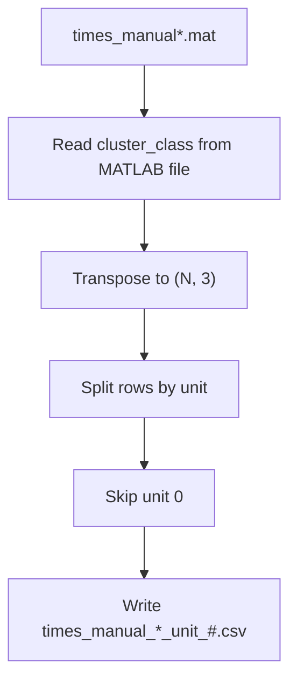

# preprocessing

> Converts raw MATLAB spike sorting output into standardized per-neuron CSV files used throughout the analysis pipeline.

---

# Table of Contents

- [Package Scope](#package-scope)
- [Package Structure](#package-structure)
- [`convert_matlab_to_csv.py`](#convert_matlab_to_csvpy)
  - [Module Inputs and Outputs](#module-inputs-and-outputs)
  - [`choose_folders()`](#choose_folders)
  - [`convert_mat_file()`](#convert_mat_file)
  - [`convert_folder()`](#convert_folder)
  - [`convert_folders()`](#convert_folders)
  - [`main()`](#main)
- [Processing Flow](#processing-flow)
- [Supported Input Files](#supported-input-files)
- [MATLAB File Assumptions](#matlab-file-assumptions)
- [Output CSV Schema](#output-csv-schema)
- [Testing](#testing)

---

# Package Scope

`preprocessing` is the first computational stage in the pipeline.

It converts Wave_Clus MATLAB output files of the form `times_manual*.mat`
into one CSV file per detected unit. Those per-unit CSVs become the input to
the remainder of the repository.

The package does not perform spike alignment, statistics, plotting, or
localization lookup. Its only job is to split the raw MATLAB spike file into a
simple per-neuron representation that downstream code can read directly.

---

# Package Structure

```text
preprocessing/

├── __init__.py
├── convert_matlab_to_csv.py
└── README.md
```

| Module | Responsibility |
|--------|----------------|
| `convert_matlab_to_csv.py` | Read each MATLAB spike sorting file and write one CSV per unit. |

---

# `convert_matlab_to_csv.py`

`convert_matlab_to_csv.py` converts one or more `times_manual*.mat` files into
the CSV files used later in the pipeline.

The module follows the historical laboratory naming convention so that the
resulting files remain compatible with older scripts and with the rest of this
repository.

## Module Inputs and Outputs

### Inputs

| Input | Description |
|------|-------------|
| `times_manual*.mat` | MATLAB v7.3 spike sorting files containing `cluster_class`. |
| Folder list | One or more folders containing those MATLAB files. |

### Outputs

| Output | Description |
|--------|-------------|
| `times_manual_*_unit_#.csv` | One CSV per unit, written next to the source MAT file or in a chosen output directory. |

### CSV schema

| Column | Type | Description |
|--------|------|-------------|
| `units` | integer | Unit identifier extracted from `cluster_class`. |
| `s` | float | Spike time in seconds. |

---

## `choose_folders()`

Opens a graphical folder picker and repeatedly prompts until the user cancels.

### Inputs

None.

### Returns

| Type | Description |
|------|-------------|
| `list[Path]` | Selected folders, in the order chosen by the user. |

### Implementation

- imports `Tk` and `filedialog` from `tkinter`
- raises a `RuntimeError` if `tkinter` is unavailable
- hides the root Tk window
- loops over `filedialog.askdirectory(...)`
- appends each selected folder to a list
- stops when the user clicks Cancel
- destroys the Tk root window before returning

This function exists so the script can still be used interactively on systems
where passing folders on the command line is inconvenient.

---

## `convert_mat_file()`

Converts one `times_manual*.mat` file into one CSV per unit.

### Inputs

| Parameter | Type | Description |
|-----------|------|-------------|
| `mat_file` | `Path` | Source MATLAB file. |
| `output_dir` | `Path | None` | Directory where CSV files should be written. Defaults to the MAT file’s directory. |
| `skip_unit0` | `bool` | Whether unit 0 should be omitted. Default: `True`. |

### Returns

| Type | Description |
|------|-------------|
| `list[Path]` | Paths to the CSV files that were written. |

### Implementation

- normalizes `mat_file` and `output_dir` to `Path`
- creates the output directory if needed
- opens the MATLAB file with `h5py.File(...)`
- checks that the file contains `cluster_class`
- reads `cluster_class` and transposes it
- validates that the result is two-dimensional
- validates that the transposed matrix has at least two columns
- extracts the unique unit numbers from column 0
- iterates over the unit IDs in numeric order
- skips unit 0 when `skip_unit0` is `True`
- selects only rows for the current unit
- writes a DataFrame with columns `units` and `s`
- uses four decimal places when writing spike times
- prints the name of each created file
- returns the list of written CSV paths

### Data handling details

The code expects `cluster_class` to be stored in MATLAB orientation as
`(3, N)` and converts it to `(N, 3)` before processing.

After transposition:

- column 0 is interpreted as the unit number
- column 1 is interpreted as spike time in seconds
- column 2 is ignored

The output CSV preserves the original spike ordering within each unit because
rows are selected directly from the transposed matrix rather than being
re-sorted.

---

## `convert_folder()`

Converts every matching MATLAB file inside one folder.

### Inputs

| Parameter | Type | Description |
|-----------|------|-------------|
| `folder` | `Path` | Folder to scan for `times_manual*.mat` files. |
| `skip_unit0` | `bool` | Whether unit 0 should be omitted. Default: `True`. |

### Returns

| Type | Description |
|------|-------------|
| `list[Path]` | All CSV files written from all matching MAT files in the folder. |

### Implementation

- normalizes the folder to a `Path`
- finds every file matching `times_manual*.mat`
- sorts the file list so conversion order is deterministic
- prints a message if no MAT files are found
- prints a folder header before processing begins
- calls `convert_mat_file(...)` for each file
- accumulates all written CSV paths into one list
- prints a completion message at the end

This function exists to support the common workflow where each patient folder
contains one or more `times_manual*.mat` files that should be processed
together.

---

## `convert_folders()`

Converts multiple patient folders.

### Inputs

| Parameter | Type | Description |
|-----------|------|-------------|
| `folders` | `list[str | Path]` | Collection of folders to process. |
| `skip_unit0` | `bool` | Whether unit 0 should be omitted. Default: `True`. |

### Returns

| Type | Description |
|------|-------------|
| `list[Path]` | All CSV files written across every processed folder. |

### Implementation

- loops over the supplied folder list
- converts each folder with `convert_folder(...)`
- extends a shared list with the returned paths
- prints a final count of CSV files created

This is the function used when the script is pointed at multiple patient
directories or a batch of data folders.

---

## `main()`

Provides the command-line entry point.

### Inputs

None.

### Returns

None.

### Implementation

- creates an `argparse.ArgumentParser`
- accepts positional `folders`
- accepts `--keep-unit-0`
- if folders were supplied, converts them to `Path` objects
- otherwise opens the interactive folder picker
- exits early if no folders were selected
- calls `convert_folders(...)` with the correct `skip_unit0` setting

The `--keep-unit-0` flag inverts the default behavior and writes unit 0 CSVs
instead of skipping them.

---

# Processing Flow



The preprocessing stage intentionally stays simple.

It performs only the minimum transformations needed to convert the MATLAB spike
sorting output into per-unit CSVs that the rest of the pipeline can consume.

---

# Supported Input Files

## MATLAB Spike Sorting Files

Expected filename pattern:

```text
times_manual*.mat
```

Examples:

```text
times_manual_GA1-RA2.mat
times_manual_LA3-LA4.mat
```

Supported format:

- MATLAB v7.3 files
- HDF5-backed files readable by `h5py`

---

# MATLAB File Assumptions

The parser expects a dataset named `cluster_class`.

Expected orientation before transposition:

```text
(3, N)
```

Expected orientation after transposition:

```text
(N, 3)
```

| Column | Description |
|--------|-------------|
| `0` | Unit identifier |
| `1` | Spike time in seconds |
| `2` | Additional metadata that is ignored by this repository |

The code only uses the first two columns.

If `cluster_class` is missing or has an unexpected shape, the conversion stops
with an explicit error rather than producing partial output.

---

# Output CSV Schema

Each detected unit is written to a file named like:

```text
times_manual_GA1-RA2_unit_5.csv
```

The output columns are:

| Column | Type | Units | Description |
|--------|------|-------|-------------|
| `units` | integer | — | Unit label copied from `cluster_class`. |
| `s` | float | seconds | Spike time. |

### Formatting behavior

- Spike times are written with four decimal places.
- Row ordering follows the original spike ordering within each unit.
- The file naming convention intentionally mirrors the historical pipeline.

---
---

# Running the Package

`convert_matlab_to_csv.py` can be executed either interactively or entirely
from the command line.

## Interactive Mode

Running the script without supplying any folders opens the folder-selection
dialog.

```bash
python preprocessing/convert_matlab_to_csv.py
```

Select one or more folders containing MATLAB spike sorting files matching

```text
times_manual*.mat
```

Click **Cancel** when you have finished selecting folders.

Each selected folder is processed independently.

---

## Command-Line Mode

One or more folders may also be supplied directly.

```bash
python preprocessing/convert_matlab_to_csv.py \
    "D:/Patient_570" \
    "D:/Patient_571"
```

Every supplied folder is scanned for MATLAB files matching

```text
times_manual*.mat
```

Each matching file is converted into one CSV for every detected unit.

---

## Keeping Unit 0

By default, the converter skips **unit 0**, which typically represents
unsorted spikes or background activity from Wave_Clus.

To keep unit 0 during conversion:

```bash
python preprocessing/convert_matlab_to_csv.py \
    "D:/Patient_570" \
    --keep-unit-0
```

All remaining behavior is unchanged.

---

## Expected Output

For an input file such as

```text
times_manual_GA1-RA2.mat
```

the converter writes

```text
times_manual_GA1-RA2_unit_1.csv
times_manual_GA1-RA2_unit_2.csv
times_manual_GA1-RA2_unit_3.csv
...
```

Each output file contains the spike train for exactly one detected unit.

---

## Typical Workflow


The generated CSV files become the direct input to the Align 1 stage of the
analysis pipeline.

In a complete pipeline run this stage is normally executed automatically by
`running/pipeline_executor.py`, but it may also be run independently when
converting new MATLAB spike sorting output or validating preprocessing results.

# Testing

The preprocessing code is covered by the repository test suite.

The tests should verify that:

- MATLAB files are read successfully when `cluster_class` is present
- unit 0 is skipped by default
- CSVs are written for each remaining unit
- folder conversion processes all matching files
- the command-line entry point honors `--keep-unit-0`

The package is intentionally small, so failures are usually easiest to debug by
checking the MATLAB file structure first, then the unit-numbering logic, then
the output directory permissions.
