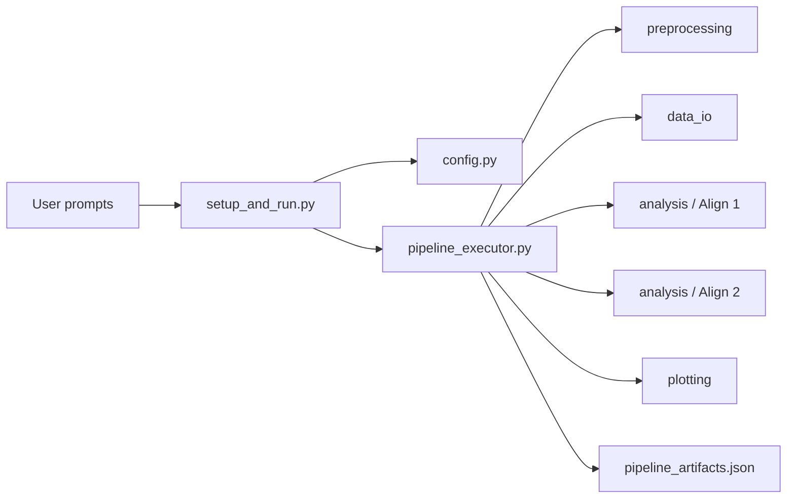

# running

> Interactive pipeline setup, configuration, output planning, and execution for the CNL 24 Python Pipeline Project.

---

# Table of Contents

- [Package Scope](#package-scope)
- [Package Structure](#package-structure)
- [Data Flow](#data-flow)
- [`config.py`](#configpy)
  - [`PatientConfig`](#patientconfig)
  - [`AnalysisConfig`](#analysisconfig)
  - [`validate_patient_config()`](#validate_patient_config)
  - [`validate_analysis_config()`](#validate_analysis_config)
- [`models.py`](#modelspy)
  - [`TrialRecord`](#trialrecord)
  - [`SpikeTrain`](#spiketrain)
  - [`AlignedSpike`](#alignedspike)
  - [`WindowStats`](#windowstats)
  - [`NeuronResult`](#neuronresult)
  - [`PipelineArtifact`](#pipelineartifact)
- [`pipeline_executor.py`](#pipeline_executorpy)
  - [`_as_pair()`](#_as_pair)
  - [`patient_dict_to_config()`](#patient_dict_to_config)
  - [`analysis_dict_to_config()`](#analysis_dict_to_config)
  - [`_patient_root()`](#_patient_root)
  - [`_add_artifacts_from_paths()`](#_add_artifacts_from_paths)
  - [`_load_trial_table()`](#_load_trial_table)
  - [`_write_localization_trace()`](#_write_localization_trace)
  - [`plan_patient_pipeline()`](#plan_patient_pipeline)
  - [`run_patient_pipeline()`](#run_patient_pipeline)
  - [`run_pipeline()`](#run_pipeline)
- [`setup_and_run.py`](#setup_and_runpy)
  - [`_prompt_str()`](#_prompt_str)
  - [`_prompt_optional_str()`](#_prompt_optional_str)
  - [`_prompt_float()`](#_prompt_float)
  - [`_prompt_patient()`](#_prompt_patient)
  - [`_prompt_movie_bin_size()`](#_prompt_movie_bin_size)
  - [`_print_tree()`](#_print_tree)
  - [`main()`](#main)
- [Testing](#testing)

---

# Package Scope

The `running` package connects the repository together.

It defines the configuration dataclasses, converts prompted dictionaries into
typed objects, plans the expected output tree, and executes the full pipeline
from preprocessing through plotting.

Unlike the scientific packages, `running` does not compute spike statistics or
generate figures directly. Its job is to coordinate the modules in the correct
order and to keep the pipeline configuration consistent.

---

# Package Structure

```text
running/

├── __init__.py
├── config.py
├── models.py
├── pipeline_executor.py
├── setup_and_run.py
└── README.md
```

| Module | Responsibility |
|--------|----------------|
| `config.py` | Defines pipeline configuration objects and validation helpers. |
| `models.py` | Defines small dataclasses used to move structured results between modules. |
| `pipeline_executor.py` | Converts raw dictionaries into typed configs, plans output paths, and runs the pipeline. |
| `setup_and_run.py` | Interactive CLI for prompting values, planning outputs, and launching execution. |

---

# Data Flow



The package is arranged so that interactive input is first normalized into
typed configuration objects, then used to plan the filesystem layout, and
finally used to execute the pipeline stages in a fixed order.

---

# `config.py`

`config.py` contains the dataclasses and validation helpers that define the
shape of the pipeline configuration.

These objects are shared by the CLI, the executor, and any code that wants to
construct pipeline runs programmatically.

## `PatientConfig`

Stores the per-patient fields required to execute a run.

### Fields

| Field | Type | Description |
|-------|------|-------------|
| `patient_id` | `str` | Patient identifier used in output paths. |
| `movie_label` | `str` | Human-readable movie label. |
| `signal_path` | `str` | Folder containing per-neuron spike CSVs. |
| `clip_ttl_csv` | `str` | Path to the raw TTL / behavioral export. |
| `localization_file` | `str` | Path to the localization workbook. |
| `output_tag` | `str` | Optional suffix appended to the patient directory. |
| `matLab` | `float` | MATLAB reference timestamp. |
| `start_unix_0` | `float` | Movie start time in Unix seconds. |
| `duration` | `float` | Movie duration in seconds. |
| `fps` | `float` | Movie frame rate. |
| `drift_rate_slope` | `float` | Optional video drift correction applied to the canonical movie timeline as `1 + drift_rate_slope`. Default: `0.0`. |

### Implementation

The dataclass is frozen, so once created it is treated as immutable
configuration.

This makes it safe to pass the object across modules without worrying that one
stage will silently modify the settings used by another stage.

> [!NOTE]
> `drift_rate_slope` is forwarded to the behavioral timing parser and also used when computing the Align 1 session duration. A value of `0.0` preserves the legacy baseline.

---

## `AnalysisConfig`

Stores the shared scientific parameters used by analysis and plotting.

### Fields

| Field | Type | Description |
|-------|------|-------------|
| `pre_window_ms` | `Tuple[int, int]` | Pre-stimulus analysis window. |
| `post_window_ms` | `Tuple[int, int]` | Post-stimulus analysis window. |
| `raster_window_ms` | `Tuple[int, int]` | Window used for raster generation. |
| `min_rate_hz` | `float` | Minimum firing rate required for plotting. |
| `alpha` | `float` | Significance threshold. |
| `stat_style` | `str` | Statistical style label. |
| `n_permutations` | `int` | Number of permutations for permutation-based workflows. |
| `smoothing` | `str` | PSTH smoothing mode. |
| `psth_bin_ms` | `int` | PSTH bin width. |
| `movie_bin_size_s` | `int` | Movie bin size used by `analysis.binning`. |
| `raster_figsize` | `Tuple[float, float]` | Raster figure dimensions. |
| `raster_dpi` | `int` | Raster image resolution. |
| `line_length` | `float` | Raster line length. |
| `line_width` | `float` | Raster line width. |
| `clip_end_marker_half_height` | `float` | Raster clip-end marker height. |

### Implementation

The dataclass is frozen and carries the shared analysis defaults used by the
pipeline when no explicit override is supplied.

`PIPELINE_ANALYSIS_CONFIG` is the repository-standard default instance.

---

## `validate_patient_config()`

Checks that the minimum patient fields required to run the pipeline are present.

### Inputs

| Parameter | Type | Description |
|-----------|------|-------------|
| `cfg` | `PatientConfig` | Patient configuration to validate. |

### Returns

None.

### Implementation

- collects missing required fields into a list
- requires `patient_id`, `signal_path`, and `clip_ttl_csv`
- raises `ValueError` when any required field is missing
- leaves the dataclass unchanged when validation passes

The function validates only the fields that the execution path actually needs
before the pipeline can begin.

---

## `validate_analysis_config()`

Checks that the numerical analysis configuration is internally consistent.

### Inputs

| Parameter | Type | Description |
|-----------|------|-------------|
| `cfg` | `AnalysisConfig` | Analysis configuration to validate. |

### Returns

None.

### Implementation

- verifies that each analysis window increases from start to end
- checks that firing-rate thresholds are nonnegative
- checks that permutation counts are positive
- checks that `alpha` is strictly between 0 and 1
- raises `ValueError` when any check fails

This keeps invalid analysis settings from reaching the execution stage.

---

# `models.py`

`models.py` contains small dataclasses used to move structured results between
modules.

The classes in this file mostly act as typed containers with conversion helpers
for serialization.

## `TrialRecord`

Represents one canonical behavioral trial.

### Fields

| Field | Type | Description |
|-------|------|-------------|
| `trial_index` | `int` | Trial index used during alignment. |
| `clip_id` | `Any` | Clip identifier from the trial table. |
| `ms_start` | `float` | Trial start time in milliseconds. |
| `ms_end` | `float` | Trial end time in milliseconds. |
| `accurate` | `int` | Accuracy label. |
| `plot_y_axis` | `int` | Plot ordering label. |
| `plot_toggle` | `int` | Plot inclusion flag. |
| `movie_id` | `Optional[int]` | Movie identifier. |
| `response` | `Optional[Any]` | Behavioral response value. |
| `reaction_time_ptb` | `Optional[float]` | Reaction time in PTB units. |

### Implementation

- stores the trial metadata used by alignment and plotting
- exposes `duration_ms` as a property computed from `ms_end - ms_start`
- exposes `to_dict()` via `dataclasses.asdict()`

---

## `SpikeTrain`

Represents one neuron's spike times.

### Fields

| Field | Type | Description |
|-------|------|-------------|
| `neuron_name` | `str` | Neuron identifier. |
| `spike_times_s` | `Tuple[float, ...]` | Spike times in seconds. |
| `spike_times_ms` | `Tuple[float, ...]` | Optional millisecond version of the same spike times. |

### Implementation

The class is a simple immutable container with `to_dict()` support.

---

## `AlignedSpike`

Represents one spike assigned to one trial.

### Fields

| Field | Type | Description |
|-------|------|-------------|
| `neuron_name` | `str` | Neuron identifier. |
| `trial_index` | `int` | Trial index. |
| `clip_id` | `Any` | Clip identifier. |
| `accurate` | `int` | Accuracy flag. |
| `spike_ms_global` | `float` | Spike time relative to movie onset. |
| `spike_ms_from_trial_start` | `float` | Spike time relative to trial onset. |
| `trial_ms_start` | `float` | Trial start time in ms. |
| `trial_ms_end` | `float` | Trial end time in ms. |
| `trial_duration_ms` | `float` | Trial duration in ms. |

### Implementation

The class carries both global and trial-relative timing so later code can
inspect either view of the same spike without recomputing offsets.

---

## `WindowStats`

Stores the result of one statistical comparison.

### Fields

| Field | Type | Description |
|-------|------|-------------|
| `t_stat` | `Optional[float]` | T statistic or `None`. |
| `p_value` | `Optional[float]` | P value or `None`. |
| `n_correct` | `int` | Number of correct trials. |
| `n_incorrect` | `int` | Number of incorrect trials. |
| `significant` | `bool` | Significance flag. |
| `method` | `str` | Statistical method label. |

### Implementation

The container is used for both pre-stimulus and post-stimulus comparisons.

---

## `NeuronResult`

Stores the summary for one neuron.

### Fields

| Field | Type | Description |
|-------|------|-------------|
| `patient_id` | `str` | Patient identifier. |
| `neuron_name` | `str` | Neuron name. |
| `localization` | `str` | Full localization label. |
| `bipolar_region` | `str` | Bipolar region abbreviation. |
| `pre` | `WindowStats` | Pre-stimulus result. |
| `post` | `WindowStats` | Post-stimulus result. |
| `t_score_diff_pre_minus_post` | `Optional[float]` | Difference score. |
| `mean_post_rate_hz` | `Optional[float]` | Mean post-stimulus firing rate. |
| `output_tag` | `str` | Optional output suffix. |
| `raster_path` | `Optional[Path]` | Path to a saved raster figure. |

### Implementation

`to_dict()` flattens the nested `WindowStats` containers into the column names
used by `analysis.statistics` and the plotting stage.

That conversion keeps the internal object model simple while still matching the
CSV schema expected by the rest of the repository.

---

## `PipelineArtifact`

Stores one generated file or directory path.

### Fields

| Field | Type | Description |
|-------|------|-------------|
| `name` | `str` | File or artifact name. |
| `path` | `Path` | Full path to the artifact. |
| `artifact_type` | `str` | Artifact category label. |

### Implementation

`to_dict()` converts the path to a string so the artifact manifest can be
written as JSON.

---

# `pipeline_executor.py`

`pipeline_executor.py` transforms dictionaries into typed pipeline objects,
plans the expected output tree, runs the end-to-end workflow, and records the
generated artifacts.

## `_as_pair()`

Normalizes an input value into a two-item tuple.

### Inputs

| Parameter | Type | Description |
|-----------|------|-------------|
| `value` | `Any` | User-supplied value that may already be a pair. |
| `default` | `Sequence` | Fallback pair. |

### Returns

| Type | Description |
|------|-------------|
| `tuple` | Two numeric values, or the default pair. |

### Implementation

- returns the default pair when `value` is `None`
- splits comma-separated strings into two floats
- accepts existing lists or tuples of length two
- falls back to the default when the input cannot be interpreted as a pair

This helper is used for configuration fields such as `raster_figsize`.

---

## `patient_dict_to_config()`

Converts a raw patient dictionary into a `PatientConfig`.

### Inputs

| Parameter | Type | Description |
|-----------|------|-------------|
| `raw` | `dict` | Unstructured patient settings, typically from prompts or JSON. |

### Returns

| Type | Description |
|------|-------------|
| `PatientConfig` | Frozen patient configuration object. |

### Implementation

- extracts each expected field from the dictionary
- converts text fields to strings
- converts numeric fields to floats
- fills missing values with empty strings or project defaults
- returns a typed dataclass instance

---

## `analysis_dict_to_config()`

Converts a raw analysis dictionary into an `AnalysisConfig`.

### Inputs

| Parameter | Type | Description |
|-----------|------|-------------|
| `raw` | `dict | None` | Optional analysis settings. |

### Returns

| Type | Description |
|------|-------------|
| `AnalysisConfig` | Frozen analysis configuration object. |

### Implementation

- returns the repository default when `raw` is `None`
- otherwise reads each supported override from the dictionary
- uses `_as_pair()` for interval-like fields
- converts numeric values to `float` or `int` as appropriate
- returns a typed dataclass instance

---

## `_patient_root()`

Computes the patient-specific root directory.

### Inputs

| Parameter | Type | Description |
|-----------|------|-------------|
| `output_root` | `Path` | Base output directory. |
| `patient_cfg` | `PatientConfig` | Patient configuration. |

### Returns

| Type | Description |
|------|-------------|
| `Path` | Patient root directory such as `P570` or `P570_TAG`. |

### Implementation

- adds `_output_tag` as a suffix when present
- prefixes the patient ID with `P`
- joins the result to `output_root`

---

## `_add_artifacts_from_paths()`

Wraps file paths as `PipelineArtifact` objects.

### Inputs

| Parameter | Type | Description |
|-----------|------|-------------|
| `paths` | `Sequence[Path]` | Artifact paths. |
| `artifact_type` | `str` | Artifact category label. |

### Returns

| Type | Description |
|------|-------------|
| `list[PipelineArtifact]` | Artifact objects for each path. |

### Implementation

The helper uses a list comprehension to convert every path into a structured
artifact record.

---

## `_load_trial_table()`

Builds the canonical trial table and returns the written path.

### Inputs

| Parameter | Type | Description |
|-----------|------|-------------|
| `ttl_csv` | `str` | Path to the raw TTL file. |
| `output_path` | `Path` | Destination for `trial_table.csv`. |

### Returns

| Type | Description |
|------|-------------|
| `tuple[pd.DataFrame, Path]` | Trial table and written path. |

### Implementation

- creates the parent directory when needed
- calls `build_trial_table(...)`
- returns the resulting DataFrame and output path

---

## `_write_localization_trace()`

Writes a CSV trace linking Align 1 files to inferred localization labels.

### Inputs

| Parameter | Type | Description |
|-----------|------|-------------|
| `align1_dir` | `Path` | Directory containing `align1_*.csv`. |
| `loc_df` | `pd.DataFrame` | Localization table. |
| `output_path` | `Path` | Destination for `localization_trace.csv`. |

### Returns

| Type | Description |
|-----------|-------------|
| `Path | None` | Trace path when rows were written, otherwise `None`. |

### Implementation

- returns `None` when the localization table is empty
- returns `None` when no Align 1 files are present
- loops over every `align1_*.csv` file
- strips the `align1_` prefix from each filename to recover the neuron name
- calls `infer_neuron_localization()` for each neuron
- falls back to `UNKNOWN` labels if inference fails
- writes the resulting row list to CSV

This file exists as a traceability artifact, not as a scientific output.

---

## `plan_patient_pipeline()`

Builds the expected filesystem plan for one patient run.

### Inputs

| Parameter | Type | Description |
|-----------|------|-------------|
| `patient_cfg` | `PatientConfig` | Patient settings. |
| `analysis_cfg` | `AnalysisConfig` | Analysis settings. |
| `output_root` | `Path` | Base output directory. |
| `bin_size_s` | `int | None` | Optional movie-bin size override. |

### Returns

| Type | Description |
|------|-------------|
| `dict` | Dictionary describing folders and file paths that should exist. |

### Implementation

- uses the patient config to compute the patient root
- creates the directory list for `data`, `align1`, `align2`, `binning`,
  `statistics`, and plot subfolders
- builds the canonical file list for `trial_table.csv`,
  `neuron_summary.csv`, `localization_trace.csv`, and `pipeline_artifacts.json`
- adds the swarm outputs and dashboard outputs expected from plotting
- returns a JSON-friendly dictionary of strings

The planner exists so dry runs can show the exact output tree before any
analysis is executed.

---

## `run_patient_pipeline()`

Runs the complete pipeline for one patient.

### Inputs

| Parameter | Type | Description |
|-----------|------|-------------|
| `patient_cfg` | `PatientConfig` | Patient settings. |
| `analysis_cfg` | `AnalysisConfig` | Analysis settings. |
| `output_root` | `Path` | Base output directory. |
| `bin_size_s` | `int | None` | Optional movie-bin size override. |

### Returns

| Type | Description |
|-----------|-------------|
| `list[PipelineArtifact]` | Manifest entries for all generated outputs. |

### Implementation

- validates both configuration objects
- computes the patient root and creates the full directory tree
- builds `data/trial_table.csv` by calling `build_trial_table()`
- computes Align 1 start time as `start_unix_0 - matLab + event_time_offset_ms/1000`
- runs Align 1 on the spike folder
- runs Align 2 using Align 1 outputs and the canonical trial table
- bins Align 1 outputs
- loads the canonical trial table for statistics
- writes `statistics/neuron_summary.csv`
- runs raster plotting
- writes the localization trace when a localization file is present
- runs swarm plotting
- runs summary dashboard generation
- writes `Run_Summary.csv` when the dashboard summary is non-empty
- writes `pipeline_artifacts.json` containing the artifact manifest

This is the central execution function for the repository.

---

## `run_pipeline()`

Runs the pipeline for one or more patients.

### Inputs

| Parameter | Type | Description |
|-----------|------|-------------|
| `raw_patient_dicts` | `Sequence[dict]` | One or more raw patient dictionaries. |
| `raw_analysis_dict` | `dict | None` | Optional analysis overrides. |
| `output_root` | `str | Path` | Base output directory. |
| `bin_size_s` | `int | None` | Optional movie-bin override. |

### Returns

| Type | Description |
|-----------|-------------|
| `list[PipelineArtifact]` | Combined artifact manifest for all patients. |

### Implementation

- converts the raw analysis dictionary into an `AnalysisConfig`
- ensures the output root exists
- converts each raw patient dictionary into a `PatientConfig`
- runs `run_patient_pipeline()` for each patient
- concatenates the resulting artifact lists

---

# `setup_and_run.py`

`setup_and_run.py` provides the interactive command-line entry point.

It prompts for the patient-specific configuration, supports a dry-run planner,
and launches the pipeline when the user is ready to execute it.

## `_prompt_str()`

Prompts for a required string.

### Inputs

| Parameter | Type | Description |
|-----------|------|-------------|
| `label` | `str` | Prompt label. |

### Returns

| Type | Description |
|-----------|-------------|
| `str` | Non-empty string entered by the user. |

### Implementation

- loops until the user enters a non-empty value
- prints a warning when the field is blank

---

## `_prompt_optional_str()`

Prompts for an optional string.

### Inputs

| Parameter | Type | Description |
|-----------|------|-------------|
| `label` | `str` | Prompt label. |

### Returns

| Type | Description |
|-----------|-------------|
| `str` | User input, possibly empty. |

### Implementation

The function reads one line of input and returns it after stripping whitespace.

---

## `_prompt_float()`

Prompts for a floating-point value.

### Inputs

| Parameter | Type | Description |
|-----------|------|-------------|
| `label` | `str` | Prompt label. |

### Returns

| Type | Description |
|-----------|-------------|
| `float` | Parsed floating-point value. |

### Implementation

- loops until the input can be parsed as a float
- prints a warning when the user enters invalid text

---

## `_prompt_patient()`

Collects the fields needed to build a patient dictionary.

### Inputs

None.

### Returns

| Type | Description |
|-----------|-------------|
| `Dict[str, object]` | Raw patient dictionary used by the executor. |

### Implementation

- prints a `PatientConfig` header
- prompts for `patient_id`, `movie_label`, `signal_path`, `clip_ttl_csv`,
  `localization_file`, `output_tag`, `matLab`, `start_unix_0`, `duration`, and
  `fps`
- returns the values in a dictionary

---

## `_prompt_movie_bin_size()`

Prompts for the movie bin size.

### Inputs

None.

### Returns

| Type | Description |
|-----------|-------------|
| `int` | Movie-bin size in seconds. |

### Implementation

- shows the repository default from `PIPELINE_ANALYSIS_CONFIG`
- accepts a blank entry to keep the default
- converts numeric input to an integer
- falls back to the default when parsing fails

---

## `_print_tree()`

Prints the planned output tree returned by `plan_patient_pipeline()`.

### Inputs

| Parameter | Type | Description |
|-----------|------|-------------|
| `plan` | `dict` | Planned filesystem layout. |

### Returns

None.

### Implementation

- prints the patient root
- prints each folder list
- prints each canonical file list
- prints each raster, swarm, and dashboard path list
- prints the planned movie-bin size

---

## `main()`

Runs the interactive launcher.

### Inputs

None.

### Returns

| Type | Description |
|-----------|-------------|
| `int` | Exit code. |

### Implementation

- parses `--dry-run`
- prints an introductory message
- prompts for one or more patient dictionaries
- prompts for the output root
- prompts for the movie-bin size
- when `--dry-run` is set:
  - converts the first-level dictionaries into typed configs
  - prints the planned output tree for each patient
  - exits with code 0
- otherwise:
  - runs the full pipeline
  - prints the output root
  - exits with code 0

---

# Testing

The `running` package is covered by the repository test suite, especially
`unit_tests/test_running_plan.py`.

The tests verify that:

- required configuration fields are validated
- invalid analysis windows are rejected
- raw dictionaries are converted into typed configuration objects
- patient roots are constructed correctly
- dry-run planning includes the expected folders and files
- the default movie-bin size is preserved unless overridden
- the pipeline executor produces the expected artifact manifest

Because `running` connects the whole repository, the tests are especially
important for catching regressions in output layout and stage ordering.
