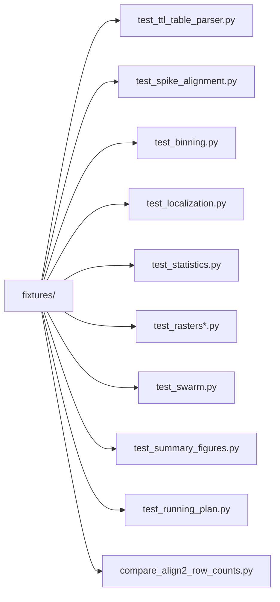

# unit_tests

> Pytest-based regression tests, fixture data, and utility scripts for the CNL 24 Python Pipeline Project.

---

# Table of Contents

- [Package Scope](#package-scope)
- [Package Structure](#package-structure)
- [Fixture Layout](#fixture-layout)
- [Test Coverage Map](#test-coverage-map)
- [Module Documentation](#module-documentation)
  - [`conftest.py`](#conftestpy)
  - [`test_ttl_table_parser.py`](#test_ttl_table_parserpy)
  - [`test_spike_alignment.py`](#test_spike_alignmentpy)
  - [`test_binning.py`](#test_binningpy)
  - [`test_localization.py`](#test_localizationpy)
  - [`test_statistics.py`](#test_statisticspy)
  - [`test_rasters.py`](#test_rasterspy)
  - [`test_rasters_movie_aligned.py`](#test_rasters_movie_alignedpy)
  - [`test_raster_selection_routing.py`](#test_raster_selection_routingpy)
  - [`test_swarm.py`](#test_swarmpy)
  - [`test_summary_figures.py`](#test_summary_figurespy)
  - [`test_running_plan.py`](#test_running_planpy)
  - [`compare_align2_row_counts.py`](#compare_align2_row_countspy)
- [Testing Notes](#testing-notes)

---

# Package Scope

`unit_tests` contains the repository's automated regression tests.

The package verifies that the refactored pipeline still matches the intended
behavior of the scientific workflow while using the current repository schemas.

The tests are intentionally synthetic and fixture-driven. They do not rely on
the full production dataset, which keeps the suite fast and repeatable.

---

# Package Structure

```text
unit_tests/

├── README.md
├── conftest.py
├── compare_align2_row_counts.py
├── test_binning.py
├── test_localization.py
├── test_rasters.py
├── test_rasters_movie_aligned.py
├── test_raster_selection_routing.py
├── test_running_plan.py
├── test_spike_alignment.py
├── test_statistics.py
├── test_summary_figures.py
├── test_swarm.py
├── test_ttl_table_parser.py
└── fixtures/
```

| Module | Responsibility |
|--------|----------------|
| `conftest.py` | Configures the test environment and adds the repository root to `sys.path`. |
| `test_ttl_table_parser.py` | Verifies behavioral-table parsing and derived trial-table fields. |
| `test_spike_alignment.py` | Verifies Align 1 and Align 2 behavior. |
| `test_binning.py` | Verifies fixed-width binning of Align 1 data. |
| `test_localization.py` | Verifies localization lookup and region descriptions. |
| `test_statistics.py` | Verifies clip-table normalization, summary rows, and population statistics. |
| `test_rasters.py` | Verifies raster generation from Align 1 data. |
| `test_rasters_movie_aligned.py` | Verifies raster utilities on movie-aligned schemas. |
| `test_raster_selection_routing.py` | Verifies raster output routing and file mirroring. |
| `test_swarm.py` | Verifies population swarm output generation. |
| `test_summary_figures.py` | Verifies dashboard and run-summary generation. |
| `test_running_plan.py` | Verifies planned filesystem layout for a patient run. |
| `compare_align2_row_counts.py` | Utility script for comparing legacy and refactored Align 2 outputs. |

---

# Fixture Layout

The fixture directories mirror the repository's current schemas.

```text
unit_tests/fixtures/

├── alignment/
│   ├── align1_times_manual_GA1-REC3_unit_1.csv
│   └── align2_times_manual_GA1-REC3_unit_1.csv
├── analysis/
│   └── neuron_summary.csv
├── data_io/
│   └── trial_table.csv
└── localization/
    └── sub-570_localizations.xlsx
```

These fixtures are small enough to keep the test suite fast, but realistic
enough to exercise the same file formats used by the pipeline itself.

---

# Test Coverage Map



---

# Module Documentation

## `conftest.py`

`conftest.py` configures the test environment before any tests run.

### Implementation

- sets `MPLBACKEND=Agg` so matplotlib can render figures in headless test runs
- calls `matplotlib.use("Agg")` to enforce the same backend at import time
- inserts the repository root into `sys.path`
- defines `FIXTURES` as the shared fixture root

### Why it is structured this way

The plotting tests create PNG files during execution. Forcing the Agg backend
keeps figure generation deterministic and prevents GUI-backend failures on CI or
on machines without a display server.

---

## `test_ttl_table_parser.py`

This file verifies the behavioral metadata parser.

### Fixtures created in the test file

The file defines `make_fake_ttl_like_real_data()`, which builds a synthetic TTL
table that mirrors the shape of the real dataset.

The synthetic table intentionally includes:

- 159 total rows
- 150 `recog_task` rows
- 75 recognition rows for `movieID == 1`
- 75 recognition rows for `movieID == 2`
- additional non-recognition rows such as `cued_recall`, `spontaneous`,
  `free_recall`, and `movie_watch`
- the same raw TTL columns used by the parser

This makes the tests realistic without depending on the production dataset.

### `test_build_trial_table_filters_like_real_data()`

Checks that `build_trial_table()` performs the expected filtering and column
derivation.

#### Implementation

- writes the synthetic TTL table to disk
- calls `build_trial_table()` with `phase="recog_task"` and `movie_id=1`
- confirms that the output path is returned and written
- confirms that only the expected recognition rows remain
- confirms that raw columns such as `frameOn`, `frameOff`, `clipStartTime`, and
  `clipEndTime` survive the transformation
- confirms that canonical derived columns are added
- spot-checks the timing conversions
- checks that `response == 2` becomes `isAccurate == 1`
- checks that `trialOrder` and `plotOrder` cover the expected range
- confirms that `includeInPlots` defaults to `True`

### `test_build_trial_table_can_keep_all_recog_trials()`

Checks that `movie_id=None` keeps all recognition rows.

#### Implementation

- writes the synthetic TTL table to disk
- calls `build_trial_table()` without a movie filter
- verifies that the full recognition-task subset is retained

---

## `test_spike_alignment.py`

This file verifies Align 1 and Align 2 behavior using synthetic spike and trial
fixtures.

### Fixtures created in the test file

`make_fake_spike_csv()` creates a per-unit spike CSV with the current
preprocessing schema:

- `units`
- `s`

`make_fake_trial_table()` creates a canonical trial table with two clip windows
that match the current refactored schema.

### `test_load_spike_csv_reads_expected_columns()`

Checks that Align 1 input loading preserves the expected spike columns.

#### Implementation

- writes the synthetic spike CSV
- calls `load_spike_csv()`
- confirms that the returned DataFrame contains `units` and `spikeTimeRawS`
- checks that the spike values are preserved exactly

### `test_align_spikes_to_movie_window_filters_and_rezeros_times()`

Checks that spikes are filtered to the movie window and re-anchored at movie
onset.

#### Implementation

- loads the synthetic spike CSV
- aligns spikes to a session window from 10.0 to 12.0 seconds
- verifies that only spikes inside the interval remain
- confirms that `movieAlignedTimeS` starts at zero
- confirms that `movieAlignedTimeMs` is the millisecond version of the same
  aligned times

### `test_align_spikes_to_trials_assigns_spikes_to_trial_windows()`

Checks that Align 2 assigns movie-aligned spikes to the correct trial windows.

#### Implementation

- aligns the synthetic spike CSV to a longer movie window
- passes the Align 1 table and the synthetic trial table to
  `align_spikes_to_trials()`
- verifies that spikes are assigned to both trial windows
- checks that relative spike time within the clip window is computed correctly

### `test_align_one_neuron_writes_align1_and_align2_outputs()`

Checks that the per-neuron alignment helpers write files to disk.

#### Implementation

- runs the Align 1 neuron writer
- feeds the resulting Align 1 file into the Align 2 neuron writer
- confirms that both files are created successfully

---

## `test_binning.py`

This file verifies the fixed-width binning helpers.

### `test_binning_matches_exact_counts()`

Checks that binning preserves spike counts and firing rates.

#### Implementation

- reads a real fixture Align 1 file
- calls `bin_firing_rate()` with a 1-second bin size
- checks the output column names
- verifies the expected spike counts
- verifies the expected firing rates

### `test_binning_writes_file()`

Checks that the file-writing helper creates a binned CSV.

#### Implementation

- bins a fixture Align 1 file into a temporary output path
- confirms that the file exists
- reads it back to confirm it is non-empty

### `test_binning_folder()`

Checks that a whole folder of Align 1 files can be binned.

#### Implementation

- creates a temporary Align 1 folder
- copies a fixture file into it
- runs the folder-level binning helper
- verifies that one output file was written and exists

---

## `test_localization.py`

This file verifies localization lookup and region description helpers.

### `test_infer_neuron_localization_returns_strings()`

Checks that localization inference returns string values.

#### Implementation

- builds a fake localization table with `electrode`, `aparc+aseg`, and
  `bipolar_region`
- calls `infer_neuron_localization()` on a real-style neuron filename
- confirms that the returned electrode code, full location, and region
  abbreviation are all strings

### `test_region_description_known_region()`

Checks that a known region abbreviation resolves to a readable label.

### `test_region_description_unknown_region()`

Checks that an unknown abbreviation falls back to `Unknown`.

---

## `test_statistics.py`

This file verifies trial-table normalization, neuron summaries, and population
statistics.

### `test_clip_table_normalization()`

Checks that the canonical trial table is renamed into the statistics schema.

#### Implementation

- loads the fixture trial table
- confirms that the statistics-friendly columns such as `ms start`, `ms end`,
  and `Accurate` exist

### `test_rate_and_ttest_helpers()`

Checks the rate and t-test helper functions.

#### Implementation

- loads a real fixture Align 1 file
- extracts `movieAlignedTimeMs`
- computes a firing rate in a time window
- computes the correct-vs-wrong t-test
- checks that the returned dictionary contains the expected statistical keys

### `test_build_neuron_summary_row()`

Checks that one neuron summary row is built correctly.

#### Implementation

- loads fixture Align 1 and trial data
- calls `build_neuron_summary_row()`
- confirms that the returned row is not `None`
- checks that the patient label is normalized to `P570`
- confirms that pre- and post-stimulus t-score fields are present

### `test_analyze_align1_folder()`

Checks that a whole folder of Align 1 files can be summarized.

#### Implementation

- copies one Align 1 fixture into a temporary folder
- loads the fixture trial table
- runs `analyze_align1_folder()`
- verifies that the output CSV is written
- confirms that one neuron summary row is produced

### `test_population_helpers()`

Checks the population summary helper functions.

#### Implementation

- loads the fixture neuron summary table
- runs:
  - `population_chisq_vs_chance()`
  - `population_chisq_vs_5050()`
  - `population_one_sample_ttest()`
- verifies that the returned dictionaries contain the expected statistic keys

---

## `test_rasters.py`

This file verifies standard raster generation from Align 1 data.

### `test_plot_single_neuron()`

Checks that one raster can be generated for one neuron.

#### Implementation

- loads a real fixture Align 1 file
- loads the fixture trial table
- calls `plot_neuron_from_align1()`
- confirms that the output PNG exists

### `test_plot_folder()`

Checks that a whole folder of Align 1 files can be plotted.

#### Implementation

- creates a temporary Align 1 folder
- copies in one fixture Align 1 file
- calls `plot_align1_folder()`
- verifies that one raster file is produced

---

## `test_rasters_movie_aligned.py`

This file verifies that raster helpers accept the movie-aligned schema used by
the refactored pipeline.

### `test_load_align1_csv_accepts_movie_aligned_columns()`

Checks that the loader preserves movie-aligned timing columns.

#### Implementation

- writes a small synthetic Align 1 CSV with `movieAlignedTimeS` and
  `movieAlignedTimeMs`
- loads it with `rasters.load_align1_csv()`
- confirms that the movie-aligned columns remain present
- confirms that `ms` is populated from `movieAlignedTimeMs`

### `test_plot_neuron_from_align1_writes_png_for_movie_aligned_schema()`

Checks that raster plotting works on the movie-aligned schema.

#### Implementation

- writes a synthetic Align 1 CSV
- creates a one-row trial table
- monkeypatches localization lookup so the plot routine receives a stable
  region label
- calls `plot_neuron_from_align1()`
- verifies that a PNG is written into the `all` folder

---

## `test_raster_selection_routing.py`

This file verifies figure routing and file mirroring behavior.

### `test_load_align1_csv_accepts_movie_aligned_columns()`

This test mirrors the schema-compatibility check from
`test_rasters_movie_aligned.py` and ensures the raster loader accepts the
refactored Align 1 column layout.

### `test_save_and_mirror_keeps_sig_and_nonsig_separate()`

Checks that a saved raster figure is mirrored into the correct category folders.

#### Implementation

- creates a dummy matplotlib figure
- saves it to an `all` path
- calls `_save_and_mirror()`
- verifies that the figure appears in `all` and the chosen category folder
- verifies that it does not appear in the opposite category folder

### `test_plot_align1_folder_filters_to_summary_neurons()`

Checks that raster generation respects the summary table.

#### Implementation

- creates two Align 1 files
- builds a summary table containing only one of them
- monkeypatches localization lookup
- calls `plot_align1_folder()`
- confirms that only the neuron present in the summary table is plotted
- verifies that the raster was routed to the expected output path

### `test_plot_neuron_from_align1_skips_below_rate_threshold()`

Checks that neurons below the minimum firing-rate threshold are skipped.

#### Implementation

- creates a sparse Align 1 file with too few spikes
- supplies a minimal trial table
- monkeypatches localization lookup
- calls `plot_neuron_from_align1()`
- expects the neuron to be rejected rather than plotted

---

## `test_swarm.py`

This file verifies swarm plot generation.

### `test_swarm_outputs()`

Checks that the population swarm routine writes the expected outputs.

#### Implementation

- loads the fixture neuron summary table
- runs `generate_population_swarm_plot()`
- confirms that the output directory exists
- confirms that the global summary CSV exists
- checks that at least one `P1_...` figure was generated

---

## `test_summary_figures.py`

This file verifies dashboard generation.

### `test_summary_figures()`

Checks that summary dashboards are built from swarm outputs.

#### Implementation

- loads the fixture neuron summary table
- generates swarm plots first
- runs `generate_summary_figures()`
- confirms that `Run_Summary.csv` exists
- confirms that the returned run-summary table is non-empty
- verifies that at least one dashboard path was returned

---

## `test_running_plan.py`

This file verifies the planned filesystem tree produced by the run planner.

### `test_plan_patient_pipeline_matches_intended_tree()`

Checks that the planned output tree matches the expected repository layout.

#### Implementation

- builds a realistic `PatientConfig`
- builds a default `AnalysisConfig`
- calls `plan_patient_pipeline()`
- verifies the planned patient root
- checks that all expected folders are included
- checks that all canonical output files are included
- verifies the raster, swarm, and dashboard destinations
- confirms the default bin size is 10 seconds

### `test_plan_patient_pipeline_uses_overrides()`

Checks that overrides are respected.

#### Implementation

- builds a smaller `PatientConfig`
- sets `bin_size_s=25` in the override call
- confirms that the planner reports a 25-second bin size

---

## `compare_align2_row_counts.py`

This script compares row counts between the legacy and refactored Align 2 outputs.

### `normalize_name()`

Normalizes file names by stripping the `align2_` and `align1_` wrappers.

### `row_count()`

Returns the number of rows in a CSV file, returning `0` for an empty file.

### `main()`

Performs a directory comparison.

#### Implementation

- parses `--old-dir`, `--new-dir`, and `--ignore-unit-0`
- builds normalized filename maps for both directories
- optionally removes `unit_0.csv` files
- computes matched and unmatched file sets
- prints the largest row-count differences
- prints files only present in one side of the comparison

The script is useful for sanity-checking the refactored Align 2 output against
legacy results.

---

# Testing Notes

The test suite is designed to be readable as documentation.

Several files build small synthetic fixtures directly in the test body so the
expected behavior is obvious from the code itself. The tests intentionally
prefer specific assertions over broad "smoke test" behavior, which makes
regressions easier to diagnose.

The suite also keeps matplotlib in a non-interactive backend, so plot generation
works consistently in headless environments and continuous-integration runs.
